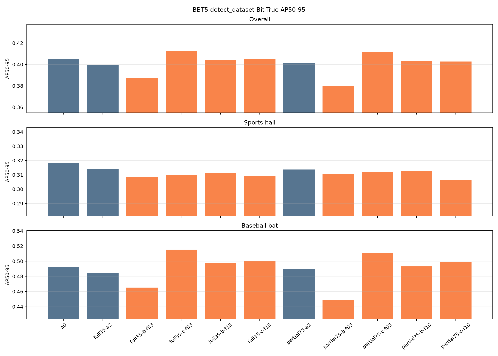
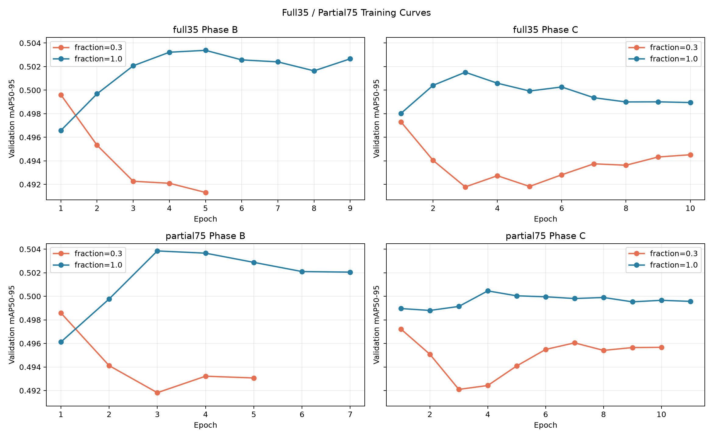
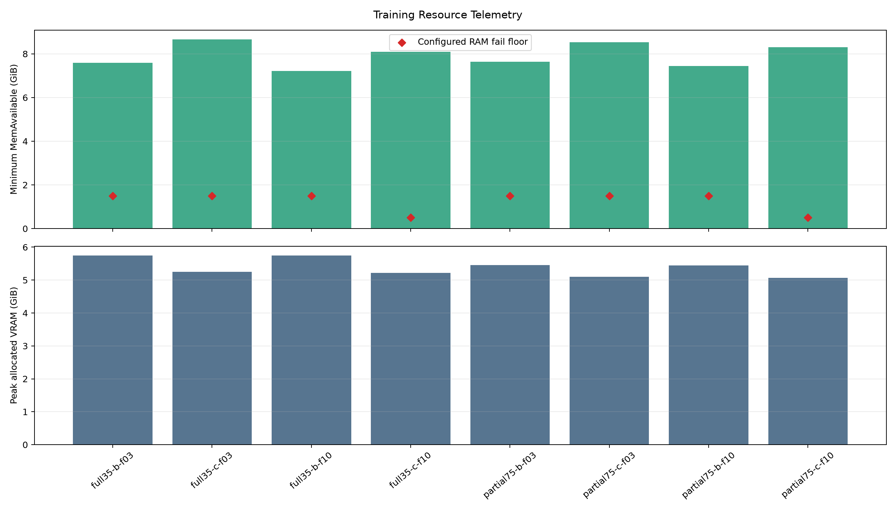

# RTX 5060 Ti Full35／Partial75 最終報告

報告日期：2026-08-24（Asia/Taipei）

## 最終結論

- 完整資料 Phase C 已完成：Full35 10 epochs、Partial75 11 epochs，兩者皆由 patience 7 early stopping，沒有 OOM、NaN 或 Inf。
- Full35 C-100% 的正式 Bit-True COCO mAP50-95 為 0.501395；Partial75 C-100% 為 0.500428，均低於各自 A2，因此 gate 都 rollback，accepted checkpoint 沒有改變。
- Full35 A2 與 Partial75 A2 的差距小於 0.001；依既定規則用同機 FP16 p50 latency、GFLOPs、Params 打破平手，Partial75 是兩個 P3-MASF 架構中的正式工程 winner。
- Partial75 A2 的 COCO mAP50-95 為 0.506754，與 A0 幾乎相同；A0 latency 仍較快。因此不能宣稱 P3-MASF 已帶來實質整體 accuracy 或端到端效率提升。
- 使用者指定的 BBT5 `detect_dataset` 是最重要的局部指標：overall 與 bat 最高都是 Full35 C-30%（0.412511／0.515345），ball 最高仍是 A0（0.318082）。這些局部結果不能繞過 COCO overall gate。

## 正式訓練摘要

| Run | Fraction | Batch / nbs | Epochs | Best epoch | Train best mAP | Final Bit-True COCO mAP | Mean epoch | Gate |
|---|---:|---:|---:|---:|---:|---:|---:|---|
| full35-b-f03 | 0.3 | 16 / 16 | 5 | 1 | 0.499610 | 0.499504 | 8.8 min | rollback |
| full35-c-f03 | 0.3 | 8 / 16 | 10 | 1 | 0.497310 | 0.497147 | 31.3 min | rollback |
| full35-b-f10 | 1.0 | 16 / 16 | 9 | 5 | 0.503380 | 0.503503 | 62.2 min | rollback |
| full35-c-f10 | 1.0 | 8 / 16 | 10 | 3 | 0.501520 | 0.501395 | 96.0 min | rollback |
| partial75-b-f03 | 0.3 | 16 / 16 | 5 | 1 | 0.498590 | 0.498286 | 21.0 min | rollback |
| partial75-c-f03 | 0.3 | 8 / 16 | 10 | 1 | 0.497220 | 0.497262 | 31.0 min | rollback |
| partial75-b-f10 | 1.0 | 16 / 16 | 7 | 3 | 0.503850 | 0.504009 | 62.4 min | rollback |
| partial75-c-f10 | 1.0 | 8 / 16 | 11 | 4 | 0.500460 | 0.500428 | 97.0 min | rollback |

每個 run 原始 `results.csv`、Ultralytics `results.png`、F1／PR／P／R curves、confusion matrix、args、manifest 與 telemetry 均保存在 `training/<model-id>/`。Phase B 固定 physical batch 16；只有 Phase C 使用 physical batch 8、`nbs=16`，等效 batch 16。

## 使用者 detect_dataset 關鍵指標

資料契約：`/home/uxin0/yolo/original/pose/detect_dataset/coco80/data.yaml`；567 images、sports ball 301 instances、baseball bat 484 instances。

### 完整資料 Phase C 相對各自 A2 的變化

| 架構 | Overall AP Δ | Ball AP Δ | Bat AP Δ | 判讀 |
|---|---:|---:|---:|---|
| full35 | +0.005395 | -0.004962 | +0.015753 | BBT5 bat 提升，但 ball 下降；COCO overall gate 仍 rollback。 |
| partial75 | +0.001127 | -0.007387 | +0.009640 | BBT5 bat 提升，但 ball 下降；COCO overall gate 仍 rollback。 |

| Model | Overall AP | Ball P | Ball R | Ball AP | Bat P | Bat R | Bat AP |
|---|---:|---:|---:|---:|---:|---:|---:|
| a0 | 0.405256 | 0.576840 | 0.611296 | 0.318082 | 0.800937 | 0.650826 | 0.492430 |
| full35-a2 | 0.399448 | 0.576841 | 0.617940 | 0.314137 | 0.805244 | 0.644628 | 0.484759 |
| full35-b-f03 | 0.386937 | 0.556672 | 0.613235 | 0.308668 | 0.816381 | 0.624655 | 0.465206 |
| full35-c-f03 | 0.412511 | 0.540349 | 0.634551 | 0.309676 | 0.787608 | 0.677686 | 0.515345 |
| full35-b-f10 | 0.404252 | 0.520986 | 0.647841 | 0.311325 | 0.769652 | 0.673554 | 0.497179 |
| full35-c-f10 | 0.404843 | 0.567095 | 0.596236 | 0.309175 | 0.837677 | 0.659091 | 0.500511 |
| partial75-a2 | 0.401554 | 0.575895 | 0.604651 | 0.313672 | 0.806506 | 0.654959 | 0.489437 |
| partial75-b-f03 | 0.379778 | 0.567165 | 0.607973 | 0.310864 | 0.798867 | 0.628099 | 0.448691 |
| partial75-c-f03 | 0.411398 | 0.555210 | 0.614618 | 0.312046 | 0.774050 | 0.696281 | 0.510749 |
| partial75-b-f10 | 0.402883 | 0.590160 | 0.601329 | 0.312693 | 0.803097 | 0.661157 | 0.493074 |
| partial75-c-f10 | 0.402681 | 0.559379 | 0.604651 | 0.306285 | 0.789873 | 0.663223 | 0.499077 |

AP50、AP75、F1、canonical COCO API 與每類完整數值見 `FULL35_PARTIAL75_AP.md`、`full35-partial75-ap.json` 與長格式 CSV。

## 同機 FP16 效率

固定 RTX 5060 Ti、imgsz 640、batch 1、FP16、20 warmup、100 iterations。

| Model | Params | GFLOPs | P3-MASF MACs | p50 latency | Peak VRAM |
|---|---:|---:|---:|---:|---:|
| a0 | 21,897,260 | 75.389 | 0 | 25.848 ms | 304.6 MiB |
| full35-a2 | 21,973,037 | 76.379 | 475,136,000 | 28.821 ms | 305.4 MiB |
| partial75-a2 | 21,903,917 | 75.479 | 40,140,800 | 27.987 ms | 305.5 MiB |

## RAM／VRAM 安全性

八個正式 B/C run 都保存 batch-interval telemetry，且皆未發生 OOM。本次完整資料 Phase C 的 fail-closed RAM floor 是使用者指定的 0.5 GiB；較早的 runs 保留各自 1.5 GiB 契約。訓練期間每個 epoch 會執行 GC、CUDA cache 清理與 `malloc_trim`。

## 限制與判讀邊界

- 所有候選只有 seed 0，微小差距仍可能是單 seed 變異。
- BBT5 valid 有 93/567 images（16.4%）的 COCO ID 出現在 COCO train2017；只適合候選間相對比較，不代表完全獨立泛化。
- Ultralytics internal 與 canonical COCO API 是不同 evaluator，兩套數字分表保存，不混用排名。
- fraction=0.3 與 fraction=1.0 是不同訓練資料契約；30% 結果不能當成完整資料訓練的絕對替代。
- `EXPERIMENT_SPEC.md` 規劃的 winner LR tuning T1／T2／T3 尚未執行；本報告宣告的是 Full35／Partial75 架構 winner，不是完成 tuning 後的最終超參數 winner。
- 本次沒有刪除 runtime artifacts，也沒有 commit 或 push。
