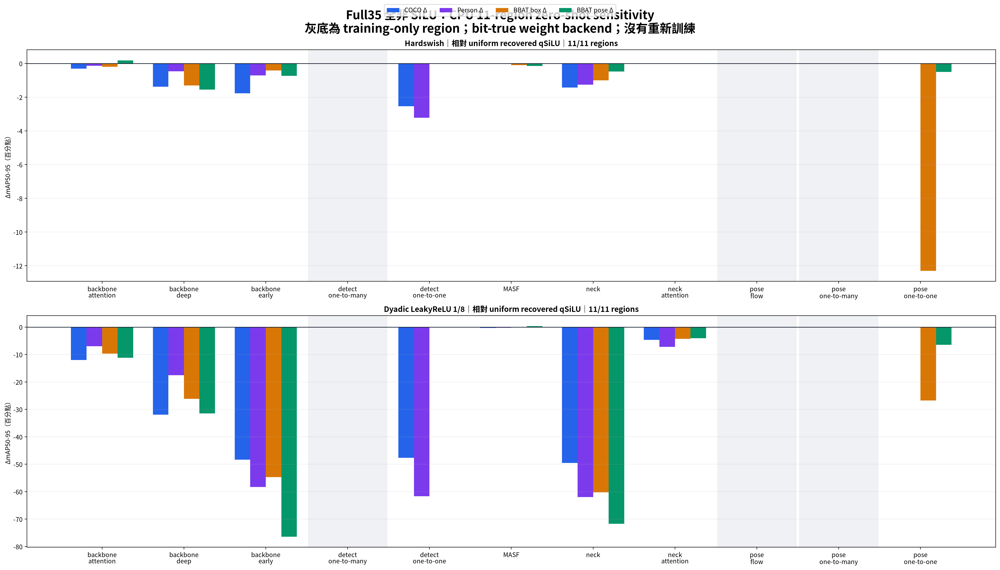
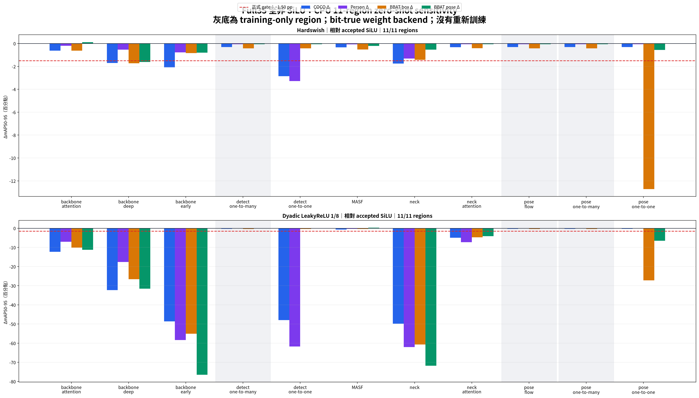

# Full35 Q3 全非 SiLU：11-region 純 CPU 最終報告

> 文件狀態：2026-08-31 完成並凍結。這一份 Markdown 是本次 Q3 的唯一人類可讀報告；
> 表格數值來自 22/22 完整 CPU zero-shot validation，不是估算、smoke test 或重新訓練結果。

## 結論先行

1. Q3 已完成 2 種簡化 activation × 11 regions，共 22/22 個案例；四個 shard 全部 exit 0。
2. 整個 Q3 沒有 optimizer、backward、epoch 或權重更新。它只回答「已完成 qSiLU recovery 權重中，
   哪些 region 可直接換成更簡單 activation」。
3. uniform recovered qSiLU 相對 accepted SiLU 的八項最差差值是 −0.008810，通過
   −0.015 gate，因此 qSiLU 可繼續作量化 fallback。
4. Hardswish 的 deployment regions 中，`backbone_attention`、`masf`、
   `neck_attention` 通過 gate；其中 `neck_attention` 對四項主指標幾乎無影響。
5. Dyadic LeakyReLU 1/8 更簡單，但 deployment regions 中只有 `masf` 通過；其餘多數區域
   精度下降很大，不適合直接大範圍替換。
6. `detect_one2many`、`pose_flow`、`pose_one2many` 是 training-only graph；
   指標為零差值不代表部署推論有任何節省。
7. 下一階段應先做 activation-aware PTQ；多區組合尚未實測，不能把單區通過結果直接相加。

## Q3 實際在測什麼

Q3 policy 的 190 個 activation sites 全部不使用 SiLU：

- 未被測試的 regions 保持已完成 recovery 的 `qsilu_pq`。
- 每次只把一個 region 換成 Hardswish 或 Dyadic LeakyReLU 1/8。
- 因此這是「相對 uniform qSiLU 的逐區敏感度」，不是重新比較 uniform SiLU、Hardswish 與 LeakyReLU。
- 每個 candidate-region 都使用同一份 qSiLU checkpoint、同一 CPU evaluator 與同一完整 validation split。

## 固定實驗契約

| 項目 | 凍結值 |
| --- | --- |
| 架構 | YOLO26m Full35 shared trunk + COCO80 Detect + BBAT5 Pose26 |
| Accepted SiLU checkpoint | `yolo_combine/final/full35/weights/combined/inference/best_joint.pt` |
| Accepted SHA-256 | `d67fb45c576035e1b9c607914c62fa2c46bad84a5f53dea2c95ea7d4155ec74c` |
| qSiLU checkpoint | `artifacts/runs/full35/short-recovery-v2-lr01-uniform-qsilu-pq-seed1/inference/best_joint.pt` |
| qSiLU SHA-256 | `7679186695317e431cd7deb17289f426f4b39b7a4993e4548e74f5ba2766190e` |
| Activation manifest | 190 sites，11 regions，使用 `remove_duplicate=False` 建立逐 path 契約 |
| COCO80 Detect | `/home/uxin/yolo/coco2017.yaml`，完整 5,000 張 val |
| Canonical BBAT5 v1 | `/home/uxin/yolo/original/pose/derived/bbat5-v1/`，固定 683 張 formal val |
| BBAT5 Pose YAML | `configs/pose.yaml` |
| BBAT5 ball/bat Detect YAML | `configs/detect.yaml` |
| 資料比例 | `fraction=1.0`、`resampling=false`；未抽樣、未重切、未改標註 |
| 影像尺寸 | 640 |
| Validation batch | Detect 32；Pose 16 |
| 執行裝置 | CPU；Bit-True weights backend |
| CPU queue | 4 shards；每 shard 4 PyTorch threads；`nice -n 10` |
| qSiLU CPU kernel | `torch.compile`／Inductor dynamic；啟動邊界 probe 與 eager 輸出逐位相同 |
| 訓練 | 無；epoch = 0 |
| Gate | 八項 mAP50-95 相對同裝置 accepted SiLU 全部不得低於 −0.015 |

Canonical BBAT5 v1 的 Pose 與 ball/bat Detect 是同一正式資料版本的兩個 Task View，共用固定
assignment。COCO80 Detect 是另一個任務資料，沒有把 BBAT5 二類 Detect YAML 接到 COCO80 head。

## CPU 與 GPU 安全證據

最初即使 validation 指定 `device="cpu"`，PyTorch／Ultralytics 仍為四個程序各建立約
498 MiB CUDA context。發現後立即停止全部四個 Q3 程序，再加入 fail-closed 防護：

1. 在匯入 PyTorch 前強制設定 `CUDA_VISIBLE_DEVICES=""`。
2. 啟動時要求 `torch.cuda.is_available() == False`。
3. 啟動時要求 `torch.cuda.device_count() == 0`。
4. 任一條件不符即停止，不允許悄悄使用 GPU。

修正後先用一個實際 COCO shard 驗證，再恢復四個 shard；多次 `nvidia-smi` 檢查均顯示
Q3 GPU 占用為 0 MiB。最終 summary 也保存 `cuda_visible_devices=""`、
`torch_cuda_available=false`、`torch_cuda_device_count=0`。

## Baseline：八項完整指標

下表所有值都在同一 CPU／Bit-True evaluator 上量測。

| 指標 | Accepted SiLU | Uniform recovered qSiLU | qSiLU Δ |
| --- | ---: | ---: | ---: |
| COCO box | 0.498460 | 0.495313 | −0.003147 |
| COCO person box | 0.620334 | 0.619684 | −0.000650 |
| BBAT overall box | 0.629451 | 0.625257 | −0.004193 |
| BBAT overall pose | 0.902102 | 0.901469 | −0.000633 |
| BBAT ball box | 0.506480 | 0.497670 | −0.008810 |
| BBAT bat box | 0.752421 | 0.752845 | +0.000424 |
| BBAT ball pose | 0.856900 | 0.857103 | +0.000202 |
| BBAT bat pose | 0.947304 | 0.945834 | −0.001469 |

八項最差是 BBAT ball box 的 −0.008810，仍在 −0.015 gate 內。

## Delta 與 Gate 讀法

- 四個主欄位的 Δ：candidate region 相對 uniform recovered qSiLU 的 raw mAP50-95 差值。
- `八項最差 global Δ`：candidate region 相對 accepted SiLU 的八項差值中最小者。
- 表中的 −0.003 等於 −0.3 個百分點；gate −0.015 等於 −1.5 個百分點。
- 正式通過必須是八項全部通過，不能只看 COCO、overall BBAT 或四項平均值。

## Hardswish：11-region 完整表

| Region | Sites | 類型 | COCO Δ | Person Δ | BBAT box Δ | BBAT pose Δ | 八項最差 global Δ | Gate |
| --- | ---: | --- | ---: | ---: | ---: | ---: | ---: | --- |
| `backbone_attention` | 3 | deployment | −0.003088 | −0.001318 | −0.002042 | +0.001839 | −0.013518 | 通過 |
| `backbone_deep` | 21 | deployment | −0.013840 | −0.004681 | −0.013060 | −0.015482 | −0.027176 | 未通過 |
| `backbone_early` | 21 | deployment | −0.017684 | −0.007098 | −0.004171 | −0.007293 | −0.020831 | 未通過 |
| `detect_one2many` | 18 | training-only | 0 | 0 | 0 | 0 | −0.008810 | 不列部署候選 |
| `detect_one2one` | 18 | deployment | −0.025383 | −0.032159 | 0 | 0 | −0.032809 | 未通過 |
| `masf` | 3 | deployment | −0.000161 | −0.000072 | −0.001016 | −0.001516 | −0.010301 | 通過 |
| `neck` | 33 | deployment | −0.014313 | −0.012533 | −0.010052 | −0.004725 | −0.017755 | 未通過 |
| `neck_attention` | 1 | deployment | −0.000039 | +0.000081 | +0.000116 | +0.000084 | −0.008581 | 通過 |
| `pose_flow` | 24 | training-only | 0 | 0 | 0 | 0 | −0.008810 | 不列部署候選 |
| `pose_one2many` | 24 | training-only | 0 | 0 | 0 | 0 | −0.008810 | 不列部署候選 |
| `pose_one2one` | 24 | deployment | 0 | 0 | −0.122989 | −0.005033 | −0.150325 | 未通過 |

Hardswish 的三個部署候選：

| 優先序 | Region | 判斷 |
| ---: | --- | --- |
| 1 | `neck_attention` | 四項主指標幾乎不變，global worst −0.008581；最乾淨的第一個量化 placement |
| 2 | `masf` | 只有 3 sites，global worst −0.010301；可與 neck attention 分開驗證 |
| 3 | `backbone_attention` | 通過但接近 gate，global worst −0.013518；量化後需特別保守 |

## Dyadic LeakyReLU 1/8：11-region 完整表

其數學定義可直接閱讀為：

- 輸入大於或等於 0：輸出保持原值。
- 輸入小於 0：輸出等於輸入除以 8。
- 固定係數 1/8 可用右移三位近似實作，不需要一般常數乘法器。

| Region | Sites | 類型 | COCO Δ | Person Δ | BBAT box Δ | BBAT pose Δ | 八項最差 global Δ | Gate |
| --- | ---: | --- | ---: | ---: | ---: | ---: | ---: | --- |
| `backbone_attention` | 3 | deployment | −0.120063 | −0.069499 | −0.097142 | −0.111852 | −0.158882 | 未通過 |
| `backbone_deep` | 21 | deployment | −0.319445 | −0.175528 | −0.261598 | −0.315181 | −0.362355 | 未通過 |
| `backbone_early` | 21 | deployment | −0.483353 | −0.582812 | −0.546675 | −0.763966 | −0.883096 | 未通過 |
| `detect_one2many` | 18 | training-only | 0 | 0 | 0 | 0 | −0.008810 | 不列部署候選 |
| `detect_one2one` | 18 | deployment | −0.476243 | −0.616454 | 0 | 0 | −0.617104 | 未通過 |
| `masf` | 3 | deployment | −0.003327 | −0.002378 | +0.000721 | +0.003232 | −0.007597 | 通過 |
| `neck` | 33 | deployment | −0.495300 | −0.619501 | −0.602429 | −0.717265 | −0.931695 | 未通過 |
| `neck_attention` | 1 | deployment | −0.046469 | −0.072178 | −0.042946 | −0.040436 | −0.089939 | 未通過 |
| `pose_flow` | 24 | training-only | 0 | 0 | 0 | 0 | −0.008810 | 不列部署候選 |
| `pose_one2many` | 24 | training-only | 0 | 0 | 0 | 0 | −0.008810 | 不列部署候選 |
| `pose_one2one` | 24 | deployment | 0 | 0 | −0.267899 | −0.064663 | −0.292648 | 未通過 |

LeakyReLU 1/8 只保留 `masf` 作「硬體極簡但需量化再驗證」候選；不能把它擴展到
backbone、neck 或 task heads。

## 運算量解析 Proxy

這是每個 activation element 的解析運算種類估計，不是 latency、功耗、晶片面積或綜合後
LUT／DSP 實測。range operation 表示比較、clip、區間選擇或 mux 類操作。

| Activation | 變數乘法 | 常數乘法 | 加減 | Range／選擇 | 超越函數 | 硬體定位 |
| --- | ---: | ---: | ---: | ---: | ---: | --- |
| qSiLU `qsilu_pq` | 1 | 8 | 10 | 5 | 0 | 一個共享平方；dyadic 分支係數；固定門檻 1／2／4／8 |
| Hardswish | 1 | 1 | 1 | 1 | 0 | 標準 fused op，或 add／clip／multiply／scale |
| LeakyReLU 1/8 | 0 | 0 | 0 | 1 | 0 | compare／mux 加負分支右移三位 |

相對 qSiLU 的解析節省：

- Hardswish：少 7 次常數乘法、9 次加減、4 次 range operations；變數乘法數相同。
- LeakyReLU 1/8：少 1 次變數乘法、8 次常數乘法、10 次加減、4 次 range operations。
- 真實效益仍取決於 compiler fusion、資料格式、記憶體流量與 target hardware，不能只用此表宣稱加速。

## 圖表

### 相對 uniform recovered qSiLU

### 相對 accepted SiLU 與正式 gate

圖中的灰色區域是 training-only graph；global 圖紅色虛線是 −1.5 個百分點 gate。

## 機器可讀證據

- [完整 Q3 summary JSON](q3-nonsilu-cpu/summary.json)
- [22 列結果 CSV](q3-nonsilu-cpu/rows.csv)
- [190-site qSiLU recovery manifest](q3-nonsilu-cpu/q3-qsilu-recovery-activation-manifest.yaml)

這些附件保存原始八項 metrics、兩種 baseline delta、policy、checkpoint hash、CPU safety 與 site 契約；
本 Markdown 仍是唯一人類可讀的結論報告。

## 問題、修正與驗證

| 項目 | 發現 | 處理與結果 |
| --- | --- | --- |
| CPU 程序仍建立 CUDA context | 四個 shard 各約 498 MiB | 停止全部程序；匯入 PyTorch 前隱藏 CUDA；加入 fail-closed guard |
| Q3 runner 在 baseline 後 KeyError | Detect-only／Pose-only region metadata 不對稱 | 改用 task-specific optional metadata，缺席 task 記為不適用與 0 |
| Ultralytics 非必要 batch plot thread error | CPU validation 仍嘗試畫 batch preview | validation 明確使用 `plots=False`，最終 Q3 圖由專用 renderer 產生 |
| qSiLU eager CPU 過慢 | activation kernel 成為主要瓶頸 | 使用共享 stateless module 與 CPU Inductor；啟動 probe 必須逐位等價 |
| sandbox `apply_patch` 失敗 | `bwrap: loopback: Failed RTM_NEWADDR` | 先用 `git apply --check`，再套用相同補丁並記錄 |

最終驗證：

- 22/22 candidate-region keys 唯一。
- 每列八項 metrics 完整；JSON 可解析，沒有 NaN／Inf。
- 兩個 checkpoint SHA-256 重算後與契約相符。
- Q3 summary：`training_performed=false`、`fraction=1.0`、`resampling=false`。
- CPU guard：CUDA 不可用、可見裝置數 0。
- 回歸測試：9 項通過。
- Ruff check 與 Ruff format check 通過。
- 最終兩張 PNG 均為 4865 × 2774 RGBA，已人工檢查標籤、四項顏色、灰底與 gate 線。

## 量化工作列交接順序

建議保持共同 calibration／observer／rounding／saturation 契約，按下列順序做：

1. Accepted SiLU 與 uniform recovered qSiLU 先跑 matched PTQ，建立 activation × quantization 基線。
2. 在 qSiLU 基底上單獨測 Hardswish `neck_attention`。
3. 分開測 Hardswish `masf`，再測 `neck_attention + masf`；組合結果不能由單區 delta 推算。
4. Hardswish `backbone_attention` margin 較小，放在前兩者通過之後。
5. LeakyReLU 1/8 只測 `masf`，作極簡硬體候選。
6. 每個 PTQ／QAT policy 重新跑相同八項 gate；任一項低於 −0.015 就淘汰或進 matched QAT。
7. 只有 PTQ 超出預算才啟動 QAT；本 Q3 不提供任何多區或量化後 accuracy 證據。

## 證據邊界

- Q3 是一次只替換一個 region 的一階 zero-shot sensitivity，不是 BCSP search，也不是 mixed-policy 訓練。
- CPU 與 GPU 浮點結果不保證 bitwise 相同；本報告所有 delta 都使用同一 CPU baseline 相減。
- LeakyReLU 1/8 在本階段是 float graph 的精確 1/8，尚未做完整 INT8／RTL bit-exact。
- qSiLU 編譯 kernel 的 bitwise 檢查是啟動邊界 probe，不等於 Q8／Q12／Q16 全碼枚舉。
- 運算量是解析 proxy；尚無指定 FPGA／ASIC、clock、precision、synthesis、latency、power 或面積實測。
- 本報告不主張多區組合已通過，也不主張 Hardswish／LeakyReLU 已優於 qSiLU 的完整量化結果。

## 最終判斷

Activation-only Q3 已可收尾。量化工作列應以 qSiLU 作非 SiLU fallback，優先測
Hardswish `neck_attention` 與 `masf`，再考慮 `backbone_attention`；LeakyReLU 1/8
只保留 `masf`。任何最終部署 policy 必須由量化後的完整八項 gate 決定。
