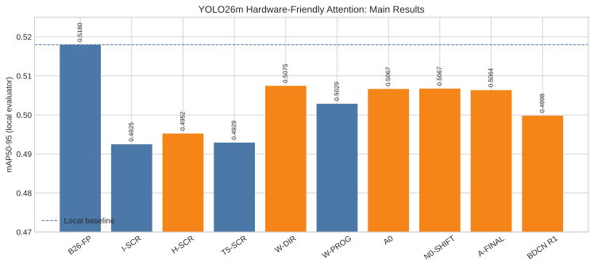

# YOLO26m Hardware-Friendly Attention

這是一套 YOLO26m Binary Attention 演算法研究與 CPU-reference 框架。程式包含 I／Hadamard MDB／T5、Dense／Decomposed 2D bias、多種 normalization、BDCN distance-codebook 分支、modular QKV、BN fold、雙 Attention fail-closed adapter、研究工作流、artifact provenance 與安全訓練入口。

本機 COCO2017 設為 `/home/uxin/yolo/coco2017`；官方權重放在 `weights/yolo26m.pt`。截至 2026-08-16，主線與 BDCN V3 共 57 個 queue jobs 全部成功；Optional Phase Q 維持鎖定。即時狀態仍以 `artifacts/queue/queue.json` 為唯一依據。

## 目前成果

| 項目 | 結果 |
|---|---:|
| B26-FP 本地 baseline mAP50-95 | 0.517998 |
| Queue-selected A-FINAL / N1-SHIFT | 0.506357 |
| Baseline retention | 97.75% |
| A-FINAL 參數量 | 21,897,260（比官方未融合模型多 1,012） |
| A-FINAL 相對 exact binary arithmetic proxy | -5.57% |
| BDCN-V3-FIXED mAP50-95 | 0.506566 |
| BDCN-V3-R1 mAP50-95 | 0.506562 |
| Queue | 57 succeeded / 0 failed |

這裡的 AP 是本 repository 對 COCO2017 val images 的 Ultralytics internal metric，不是 canonical COCO API AP，也不能直接和官方 0.525 E2E／0.531 Non-E2E 混用。完整數據與限制見 [完整實驗報告](reports/REPORT.md)、[BDCN V3 完整報告](reports/BDCN_V3_REPORT.md)、[Attention 運算量、全模型占比與大小整合報告](reports/COMPUTE_AND_SIZE.md)、[訓練稽核](reports/TRAINING_AUDIT.md)、[比較表](reports/comparison.csv) 與 [機器可讀摘要](reports/summary.json)。

## 研究邊界

- 模型：官方 `yolo26m.pt`。
- 資料：COCO2017 train2017／val2017。
- 同時修改 `model.10.m.0.attn` 與 `model.22.m.0.1.attn` 的 QK score 與 normalization path。
- 保留 $P \times V+PE(V)$、projection、FFN、兩個 residual 與完整 C2PSA CSP path。
- 不使用 $Q\odot K$、local key prior、raw HardSigmoid 或 KD。
- 正式主線以 A-FINAL binary Q/K 演算法模型與完整 COCO 報告結束。W8A8、U8 P、S8 V、LUT Softmax、5/6-bit、ternary 與 SD4 都是需另行核准的 Optional Phase Q。

完整研究規格見 [plan.md](plan.md)，程式 seam 與修改方式見 [docs/architecture.md](docs/architecture.md)。

## 程式資料流

~~~text
VariantConfig
      ↓
HardwareFriendlyAttention.from_ultralytics()
      ├─ ModularQKVProjection
      ├─ BinaryScore (FP / I / H / T5)
      ├─ RelativePositionBias
      ├─ Exact / LUT / PWL / PoT / HardSigmoid / ReLU / Multimax
      ├─ BDCN：distance bucket → codebook → R0/R1/R2 denominator
      └─ official V → dense PV 或 fused bucket-PV → PE(V) → projection
      ↓
convert_yolo26_model()  # 必須命中兩處，否則報錯
      ↓
HardwareAttentionTrainer
~~~

官方 fused QKV channels 是逐 head 的 `[Q_h,K_h,V_h]`。projection 模組會依 head gather，P0 時再 interleave 回官方 layout；不能直接 contiguous 切成三大段。

## 模型修改位置與保留結構

~~~text
YOLO26m
├─ model.10.m.0.attn       ─┐
└─ model.22.m.0.1.attn     ─┴─ 必須同時轉換，否則 fail closed

C2PSA / C3k2 outer block
X → cv1 → split
    ├────────────────────────────── a ─┐
    └→ b → PSABlock(s)                 ├→ concat → cv2

PSABlock
x → Attention → residual → FFN → residual
          │
          ├─ Q/K → Binary basis → score → bias → normalization → P
          ├─ V ────────────────────────────────────────────────→ P×V
          └─ PE(V) ────────────────────────────────┐
                                                   ├→ Projection
                                     PV ───────────┘
~~~

本研究只改 Q/K score 與 normalization。V、`PV + PE(V)`、output projection、PSABlock 的兩個 residual、FFN、外層 CSP branch 與 Detect 全部保留。

## 安裝與 CPU 驗證

本機父 repo 已有 `.venv` 時：

~~~bash
../.venv/bin/python -m pip install -e . --no-deps
../.venv/bin/python -m pytest -q
~~~

常用命令：

~~~bash
../.venv/bin/python -m yolo_attention.cli list
../.venv/bin/python -m yolo_attention.cli workflow
../.venv/bin/python -m yolo_attention.cli profile
../.venv/bin/python -m yolo_attention.cli smoke \
  --model yolo26m.yaml \
  --variant configs/variants/h-screen.yaml \
  --imgsz 64

# BDCN primary hardware path（CPU reference）
../.venv/bin/python -m yolo_attention.cli smoke \
  --model yolo26m.yaml \
  --variant configs/variants/bdcn-r1-rlut.yaml \
  --imgsz 64
~~~

## 安全訓練入口

下列命令只顯示 dry-run，不會開始訓練：

~~~bash
../.venv/bin/python -m yolo_attention.cli train \
  --variant configs/variants/h-screen.yaml \
  --training configs/training/screening.yaml \
  --run-id h-screen-seed0
~~~

只有加上 `--execute` 才會建立 run artifact 並呼叫 Ultralytics trainer。資料與權重路徑已設定；正式執行前仍須確認 batch、device、磁碟空間與 evaluator。

## 單 worker 實驗 queue

主線可先完整排入 persistent queue，而不啟動 GPU：

~~~bash
# 只建立 artifacts/queue/queue.json，不執行任何 job
../.venv/bin/python -m yolo_attention.cli queue init --json

# 檢查 schema、YAML、COCO 路徑與 yolo26m.pt
../.venv/bin/python -m yolo_attention.cli queue validate --json

# 查看下一個 job；run-next 不加 --execute 也只會預覽
../.venv/bin/python -m yolo_attention.cli queue next --json
../.venv/bin/python -m yolo_attention.cli queue run-next --json
~~~

若未來建立新 queue，GPU 空出後可每次只執行一個 job：

~~~bash
../.venv/bin/python -m yolo_attention.cli queue run-next --execute --json
~~~

`queue run --execute` 會依 gate 連續跑到沒有 ready job 或遇到失敗；研究期間較建議使用 `run-next`，逐項檢查結果。失敗 job 可用 `queue retry JOB_ID` 重新排隊。若程式錯誤使某個已完成 selection 之後的結果失效，使用 `queue rewind SELECTION_JOB_ID`；它會留下事件紀錄，並把後續 run/generated artifacts 移到 `artifacts/invalidated/`，再由該 selection 重新生成流程。selection 只讀成功 parent 的標準 `map50_95`、row-sum error 與 analytical profile，缺資料會 fail closed；一般 child 若只保留不到 model parent 50% 的 mAP，也會標成 failed 等待人工檢查。唯一例外是明列為 accuracy-bound diagnostic 的 `R2-PSHIFT`：它仍須產生有限且完整的結果 artifact，但低精度會被記錄為研究負結果，不會被誤判成 worker 故障或阻塞 R1 selection。Optional Phase Q 不會被 queue 自動建立。

若訓練已跑滿 epochs，且 `best.pt`、`last.pt`、`results.csv` 都完整，
`queue retry` 只會重做失敗的 evaluation/profile，不會重新訓練或覆寫 checkpoint。

主線已完成到 A-FINAL；後續 BDCN append branch 的即時狀態只以
`artifacts/queue/queue.json` 為準，不得手改。若只要確認：

~~~bash
../.venv/bin/python -m yolo_attention.cli queue status --json
../.venv/bin/python -m yolo_attention.cli queue validate --json
~~~

若要追加不覆寫舊結果的 BDCN v2 defect-fix branch：

~~~bash
../.venv/bin/python -m yolo_attention.cli queue append-bdcn-v2 --json
../.venv/bin/python -m yolo_attention.cli queue validate --json
../.venv/bin/python -m yolo_attention.cli queue run --execute --json
~~~

它直接從 A0（V1-BR）跑 10 epochs learned codebook，再做 reciprocal-LUT
evaluation，不增加 levels screening。詳細設定與結果位置見 [BCND/README.md](BCND/README.md)。
若 v2 完成後要比較「固定表本身」與「codebook 學習」而不延續 unconstrained drift：

~~~bash
../.venv/bin/python -m yolo_attention.cli queue append-bdcn-v3 --json
../.venv/bin/python -m yolo_attention.cli queue validate --json
../.venv/bin/python -m yolo_attention.cli queue run --execute --json
~~~

v3 依序執行 `BDCN-V3-FIXED` zero-train control、5-epoch
`BDCN-V3-LEARN`、以及 `BDCN-V3-R1`。三者固定
$L=64,d_{\max}=8,\Delta=8/63$；learned table 從 exponential table 精確初始化，
使用 `5e-6` learning rate 與 bounded log-ratio，不能回到舊
$L=16,\Delta=0.125$ 的 flat-tail 缺陷。append 命令只有在現有 queue 全部完成後
才會成功，GPU 執行仍需明確加入 `--execute`。

D1 依序執行 `D1-SHARED`、`D1-PATTN`、`D1-PHEAD`，每個候選都是從共同 D0 parent 開始的一次完整 10-epoch codebook-only run；`D1-SELECT` 直接比較這三個結果。只有 top-two 落在 0.001 tie band 時，queue 才加入 winner 的 seed-1 10-epoch confirmation，完成後自動接回 D2、R 與 A-FINAL。舊 artifacts 中的 `d1-*-10` 是先前已完成的 staged 5+5 歷史紀錄，不代表目前程式仍採 extension workflow。

## Repository 結構

~~~text
yolo_attention/
├── pyproject.toml
├── README.md
├── AGENTS.md            # 開發、執行、結果與文件維護契約
├── plan.md
├── configs/
│   ├── variants/          # Attention 方法
│   ├── training/          # 訓練資源與 schedule
│   └── evaluation/        # 共用 COCO evaluator
├── data/coco2017.yaml
├── weights/              # 官方 yolo26m.pt 與權重來源說明
├── src/yolo_attention/
│   ├── config.py          # VariantConfig public seam
│   ├── projection.py      # QKV gather/interleave、BN fold
│   ├── binary_basis.py    # I/H/T5、XNOR-popcount
│   ├── relative_bias.py
│   ├── normalization.py
│   ├── bdcn.py           # codebook、PoT projection、R0/R1/R2、fused bucket-PV
│   ├── quantization.py
│   ├── attention.py
│   ├── integration.py
│   ├── experiments.py
│   ├── workflow.py      # 主線與 optional phase 的單一流程定義
│   ├── training.py
│   ├── runner.py
│   ├── artifacts.py
│   ├── profiling.py
│   ├── queue_model.py     # persistent queue schema
│   ├── queue_store.py     # atomic state、event log、worker lock
│   ├── queue_policy.py    # 純 winner/gate 規則
│   ├── queue_workflow.py  # 動態實驗 graph 與 winner-derived YAML
│   ├── queue_backend.py   # train/evaluate/P0/select dispatch
│   ├── queue_executor.py  # 單 worker 狀態機
│   └── cli.py           # 唯一公開入口
├── scripts/main.py      # CLI 薄包裝
├── tests/
├── BCND/                  # BDCN v2 defect-fix 設定、說明與結果索引
├── reports/               # 正式彙整、training audit、CSV/JSON 摘要
├── artifacts/
│   ├── logs/              # worker 程序 log
│   ├── queue/             # queue.json、events.jsonl、generated YAML
│   ├── runs/              # 每個 job 的 metrics/profile/checkpoint
│   └── invalidated/       # rewind 保留的歷史失效結果
└── docs/
    ├── architecture.md
    ├── research/          # 論文、prior art、量化延後分析
    └── superpowers/       # 歷史 implementation plan/spec
~~~

每個由人維護的功能目錄都有 README，說明用途、輸入、輸出與 Git 規則；queue-generated job/run leaf 由其父目錄 README 統一約束，不在每個自動產生目錄重複放文件。

## 文件導航與優先序

1. [AGENTS.md](AGENTS.md)：維護、安全與驗收契約。
2. [plan.md](plan.md)：研究方法、實驗順序與 gate。
3. [docs/architecture.md](docs/architecture.md)：程式 seam 與修改位置。
4. [reports/REPORT.md](reports/REPORT.md)：本次完整結果與分析。
5. [reports/TRAINING_AUDIT.md](reports/TRAINING_AUDIT.md)：checkpoint、epoch、finite-value 與 provenance 稽核。
6. [reports/COMPUTE_AND_SIZE.md](reports/COMPUTE_AND_SIZE.md)：原始 Attention、全模型占比、節省原因、corrected proxy、參數與 checkpoint 大小。
7. [BCND/README.md](BCND/README.md)：BDCN v2/v3 修正原因、設定與重跑方法。
8. [reports/BDCN_V3_REPORT.md](reports/BDCN_V3_REPORT.md)：每一步實作、正式結果、成本與最終判定。
9. [reports/CLEANUP.md](reports/CLEANUP.md)：永久刪除與保留項目。
10. [configs/README.md](configs/README.md)、[src/README.md](src/README.md)、[artifacts/README.md](artifacts/README.md)：局部操作與資料契約。
11. `hardware-friendly_attention.md`：舊 YOLO11 背景，不具現行規格效力。

## 已知限制與下一步

- W-DIR/W-PROG 分別在 26/40、11/40 early stop；這是 patience 觸發，不是 crash。
- D1 shared 的 seed 0/1 相差 2.508 AP，BDCN learned codebook 尚不能宣稱穩定。
- N0-SHIFT 比 N1-SHIFT 高 0.039 AP；目前 A-FINAL 是 queue policy winner，不是所有 normalization 的純精度最大值。
- 現有 evaluate-only artifacts 與 runtime Ultralytics commit provenance 尚不完整。
- 尚未完成 canonical COCO API、三 seed、最終 BN-fold/bit-true export、GPU/FPGA latency/energy。
- 量化、INT5/6/7/8、ternary、SD4 與 QAT 仍為 optional，沒有在本次整理中啟動。

## 外部依據

- [Ultralytics YOLO26](https://docs.ultralytics.com/models/yolo26/)
- [Ultralytics YOLO architecture guide](https://docs.ultralytics.com/guides/yolo-architecture/)
- [Official YOLO26 configurations](https://github.com/ultralytics/ultralytics/tree/main/ultralytics/cfg/models/26)

其餘論文與量化來源見 `plan.md`。
