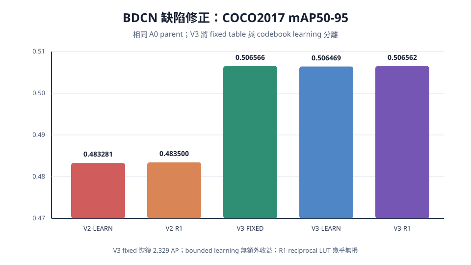

# BDCN 缺陷修正與 V3 完整實驗報告

日期：2026-08-16

## 1. 研究問題與最終答案

本實驗只處理 BDCN（Binary Distance-Codebook Normalization）已確認的缺陷，沒有加入新的 normalization 候選，也沒有改動 A0 已完成的 Binary Q/K、scale、relative-position bias 或 YOLO26m 其餘結構。

最終答案是：舊 BDCN 的主要掉點不是 64-level distance discretization 本身，而是 unconstrained learned codebook 把 exponential tail 拉平。把 table 改為正確覆蓋 $d\in[0,8]$ 並保留 fixed exponential shape 後，mAP50-95 從 V2-LEARN 的 0.483281 回到 V3-FIXED 的 0.506566。bounded codebook training 得到 0.506469，沒有優於 fixed table；R1 reciprocal LUT 得到 0.506562，與 exact denominator 的差只有 $4.56\times10^{-6}$。

目前最合理的 BDCN 版本是：

- 演算法 reference：`BDCN-V3-FIXED`。
- 硬體 denominator 候選：`BDCN-V3-R1`。
- 不建議繼續訓練 codebook，因為沒有量測到精度收益。

## 2. 固定不變的模型邊界

Parent 是已完成補償的 A0／V1-BR checkpoint。兩個 Attention 必須同時替換：

- `model.10.m.0.attn`
- `model.22.m.0.1.attn`

只更換 score normalization：

```text
Q/K → Hadamard MDB Binary score → PoT scale → decomposed 2D bias
    → BDCN distance bucket/codebook/denominator → P×V
```

V、$PV+PE(V)$、output projection、PSABlock residual/FFN、外層 C2PSA/C3k2、Detect 全部保留。custom-parent state coverage 為 99.259%，高於 95% fail-closed 門檻；10 個已比對 compensation tensors 的最大絕對誤差為 0。

## 3. 原始缺陷如何產生

BDCN 先計算每列距離，再映射到 codebook：

$$
d_{ij}=\max_k S_{ik}-S_{ij},
$$

$$
b_{ij}=\operatorname{clip}\left(\operatorname{round}\left(\frac{d_{ij}}{\Delta}\right),0,L-1\right),
\qquad w_{ij}=C[b_{ij}].
$$

舊設定 $L=16,\Delta=0.125$ 只能表示到 $d_{max}=1.875$。因此 $d=1.875$、$d=8$ 與所有更大距離都共用最後權重 $C[15]=e^{-1.875}\approx0.153355$。但 $e^{-8}\approx0.000335$；遠距 token 被高估約 457 倍。Scale 與 position bias 都在 bucketization 前，無法在不同距離已被 clamp 到同一 bucket 後把它們重新分開。

## 4. 每一版怎麼做

### 4.1 V2：先修 range collapse

V2 固定 $L=64$、$d_{max}=8$、$\Delta=8/63=0.126984$。這保留接近 0.125 的 resolution，並讓最後權重回到 $e^{-8}$。同時加入 validation histogram、true overflow、last-bucket occupancy 與 observed maximum distance。overflow 直接以 $d>d_{max}$ 判定，不再由 rounded bucket index 反推。

V2 直接跑 10-epoch codebook-only recovery，但 table 可自由變平。結果只有 0.483281，顯示「修 range」仍不足以防止 learned shape drift。

### 4.2 V3-FIXED：隔離 discretization 本身

V3-FIXED 從相同 A0 parent 建 graph，使用同一個 64-level exponential table，不做任何訓練。結果 0.506566，證明 64-level discretization 並不是 V2 大幅掉點的原因。

### 4.3 V3-LEARN：只允許小幅、單調的 table 更新

V3-LEARN 只解凍兩處 Attention 共用的 codebook，訓練 5 epochs，learning rate 為 $5\times10^{-6}$。相鄰項使用：

$$
\log\frac{C_{l+1}}{C_l}=-\Delta+0.01\tanh(r_l).
$$

初始化精確等同 fixed exponential table；`raw_deltas` 仍有有限且非零梯度，因此不是假訓練，但最平極端的 tail 仍低於 0.001，不會回到舊版 0.153。5 個 epoch 的 validation mAP50-95 依序約為 0.50667、0.50614、0.50658、0.50654、0.50642；標準化 best-checkpoint evaluation 為 0.506469。它比 fixed 低 0.000097，因此沒有證據支持 codebook learning 有益。

### 4.4 V3-R1：只替換 denominator

V3-R1 沿用 V3-LEARN checkpoint 與同一張 table，只把 exact reciprocal 換成 reciprocal LUT。BDCN 仍需 denominator；R1 是用 LUT 近似 reciprocal，不應寫成完全 division-free。真正只靠 PoT shift 的 R2 在舊實驗已掉到 0.004872，僅能當精度下界。

## 5. 正式 COCO2017 結果

所有值來自各 run 的 `metrics/queue-result.json`，使用同一組 COCO2017 val images 與 repository evaluator。它是 Ultralytics internal metric，不冒充 canonical COCO API AP。

| Run | mAP50-95 | mAP50 | mAP75 | Row-sum max error | Overflow | Last bucket | Max distance |
|---|---:|---:|---:|---:|---:|---:|---:|
| V2-LEARN | 0.483281 | 0.656456 | 0.527091 | $5.96\times10^{-8}$ | 0.205165 | 0.210540 | 34.6934 |
| V2-R1 | 0.483500 | 0.656842 | 0.527586 | 0.001960 | 0.205146 | 0.210519 | 34.6934 |
| V3-FIXED | **0.506566** | **0.677051** | **0.554965** | $5.96\times10^{-8}$ | 0.197186 | 0.202423 | 33.8770 |
| V3-LEARN | 0.506469 | 0.677038 | 0.554674 | $5.96\times10^{-8}$ | 0.197678 | 0.202929 | 33.3770 |
| V3-R1 | 0.506562 | 0.677044 | 0.554460 | 0.001951 | 0.197674 | 0.202925 | 33.3770 |



重要差值：

- V3-FIXED − V2-LEARN：+0.023285（+2.329 AP）。
- V3-LEARN − V3-FIXED：−0.000097（−0.010 AP）。
- V3-R1 − V3-FIXED：−0.000005，可視為相同。
- V3-R1 − N0-PWL：−0.000210；精度很接近，但 BDCN 的 $L=64$ 成本較高。
- V3-R1 − A-FINAL/N1-SHIFT：+0.000205；兩者差距小於 0.001 tie band。
- V3-R1 − local FP baseline：−0.011436（保留 97.79% mAP）。

約 19.8% distance 超過 8 並不代表缺陷仍存在。現在它們雖然仍 clamp 到最後一格，但使用的是約 $e^{-8}$ 的極小權重，不再是 $e^{-1.875}$ 的高權重。若未來要研究更大 range，必須連同 levels、table weighting 與 memory 成本重新比較。

## 6. 成本與取捨

固定兩個 sites、$T=400,H=4,d_k=32,d_v=64$：

| 方法 | Arithmetic proxy | 含 bias 保守值 | Memory proxy | 相對原始局部區域 | mAP50-95 |
|---|---:|---:|---:|---:|---:|
| 原始 FP QK + exact Softmax + PV | 129,286,400 | 129,286,400 | 2,764,800 | reference | 0.517998 |
| A-FINAL / SHIFT | 86,790,400 | 89,350,400 | 2,764,800 | −32.87% / −30.89% | 0.506357 |
| PWL N0 | 89,350,400 | 91,910,400 | 2,764,800 | −30.89% / −28.91% | 0.506772 |
| V3-FIXED | 113,030,400 | 115,590,400 | 14,387,200 | −12.57% / −10.59% | 0.506566 |
| V3-R1 | 113,008,000 | 115,568,000 | 14,387,200 | −12.59% / −10.61% | 0.506562 |

BDCN $L=64$ 的主要額外成本是 $C_{table}=AHTLd_v$，所以 levels 從 16 增至 64，arithmetic 與 memory proxy 都線性增加。V3-R1 雖比原始局部分析區域少 12.59%，卻比 A-FINAL arithmetic proxy 高約 30.21%，memory proxy 高約 420%。因此它的價值是「保留 normalization、可用 reciprocal LUT、精度接近 PWL」，不是目前最省的方案。

這些都是 analytical event-count proxy；FP MAC、packed binary word op、add/sub、LUT 不可直接當成相同 cycle 或 energy。整個被分析 Attention 區域只約占 YOLO26m 75.4 GFLOPs 的 0.334%，不能宣稱整體模型加速 12.59%。

## 7. 程式實作與驗證

| 部分 | 實作位置 | 驗證方式 |
|---|---|---|
| enum、range、bounded ratio | `src/yolo_attention/config.py` | YAML round-trip、不合法組合 fail closed |
| bucket、codebook、R0/R1/R2 | `src/yolo_attention/bdcn.py` | range/tail、gradient、normalization、CUDA diagnostics tests |
| 雙 Attention 接線 | `src/yolo_attention/integration.py` | 必須精確命中兩路，少一路直接失敗 |
| parent load/freeze | `src/yolo_attention/training.py` | state coverage、scope、finite loss checks |
| queue graph | `src/yolo_attention/queue_workflow.py` | fixed → learn → R1 dependency tests |
| live dispatch/retry | `src/yolo_attention/queue_backend.py` | 完整 checkpoint 才可只重跑 postprocess |
| 結果與 profile | `artifacts/runs/<run-id>/` | queue-result.json、analytical.json |

V2 訓練後 evaluation 曾發現 checkpoint-restored CPU diagnostic histogram 與 CUDA tensor 混用。修正後 diagnostics 一律在 CPU 累加，並用實際 `best.pt` 做 CUDA forward regression。retry 只在 `best.pt`、`last.pt`、`results.csv` 與預期 epochs 都完整時略過 trainer，因此該次只重做 evaluation/profile，沒有偽造或重跑訓練。

完整品質門檻：`148 passed`，Ruff 全部通過；57 個 queue jobs 最終皆為 `succeeded`，worker 已退出。

## 8. 重現方式與檔案位置

```bash
../.venv/bin/python -m yolo_attention.cli queue status --json
../.venv/bin/python -m yolo_attention.cli queue validate --json

# 只有建立新 queue 或重做研究時才追加；不加 --execute 不會啟動 GPU
../.venv/bin/python -m yolo_attention.cli queue append-bdcn-v3 --json
../.venv/bin/python -m yolo_attention.cli queue run --execute --json
```

- 方法設定：`BCND/configs/`。
- 訓練設定：`configs/training/bdcn-codebook-stable.yaml`。
- Queue provenance：`artifacts/queue/queue.json`、`events.jsonl`。
- V3 metrics/profile：`artifacts/runs/bdcn-v3-*/`。
- V3 learned best checkpoint：`artifacts/runs/bdcn-v3-learn/ultralytics/weights/best.pt`。
- 機器可讀表：`reports/bdcn_v3_results.csv`。

## 9. 最終研究判定

1. range-collapse 與 tail overweight 缺陷已從機制上修正。
2. fixed 64-level exponential BDCN 精度接近 PWL、SHIFT 與 A-FINAL。
3. bounded codebook 可以安全訓練，但目前沒有帶來收益；不應把它列為必要步驟。
4. R1 reciprocal LUT 幾乎無損，是可保留的硬體候選；BDCN 仍不可籠統稱為 division-free。
5. 若優先考慮簡單與成本，保留 A-FINAL/SHIFT 或 N0-PWL；若要研究 distance-codebook dataflow，使用 V3-FIXED/R1，不再使用 V2 learned table。
