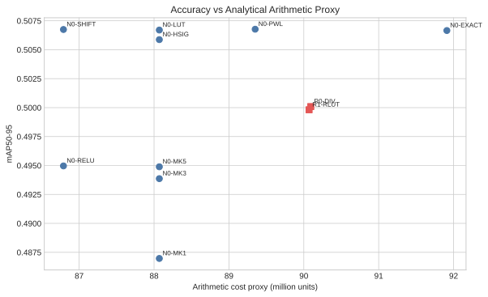
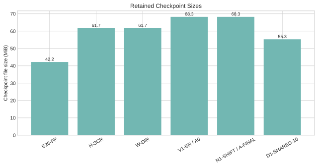

# 計算量、記憶體與模型大小

日期：2026-08-15

## 1. 分析範圍

本章只計算兩個被替換的 YOLO26m Attention sites，不把 backbone、neck、Detect、QKV/output/PE convolution 或 FFN 混入 Attention score proxy。固定 batch 1 reference shape：

| 符號 | 意義 | 數值 |
|---|---|---:|
| $A$ | Attention sites | 2 |
| $T$ | 每處 tokens | 400 |
| $H$ | heads | 4 |
| $d_k$ | key dimension | 32 |
| $d_v$ | value dimension | 64 |
| $W$ | packed word bits | 32 |
| $L$ | BDCN levels | 16 |

這些 shape 已由兩個 checkpoint module 核對。所有數字是演算法 proxy，不是 GPU FLOPs、latency、FPGA cycles、BRAM/DSP 或 energy。

## 2. 基本公式

Score entries 與 rows：

$$E=AHT^2=2\times4\times400^2=1{,}280{,}000$$

$$R=AHT=2\times4\times400=3{,}200$$

### FP 與 Binary QK

FP QK MAC reference：

$$C_{QK}^{FP}=E d_k=40{,}960{,}000$$

單一 binary basis 的 packed XNOR+popcount word operations：

$$C_{QK}^{bin,1}=E\left\lceil\frac{d_k}{W}\right\rceil=1{,}280{,}000$$

Hadamard MDB 計算 Identity 與 Hadamard 兩個 basis：

$$C_{QK}^{MDB}=2C_{QK}^{bin,1}=2{,}560{,}000$$

兩處 Q/K Walsh-Hadamard transform 的 butterfly add/sub：

$$C_H=2AHTd_k\log_2(d_k)=1{,}024{,}000$$

Packed word operation 與 FP MAC 不是等價能耗單位；必須在指定硬體後才能換算 cycle/energy。

### 保留的 dense $PV$

$$C_{PV}=E d_v=81{,}920{,}000$$

它占 SHIFT 總 proxy：

$$\frac{81{,}920{,}000}{86{,}790{,}400}=94.4\%$$

因此目前簡化的是 QK 與 normalization，不是整個 YOLO26m 或 dense $PV$。

### Dense normalization

每個 score entry 使用固定比較權重，再加每列 reduction/normalization 的 $2R$：

$$C_{norm}=cE+2R$$

Exact、PWL、LUT/HardSigmoid/Multimax、Shift/ReLU 的 $c$ 分別為 5、3、2、1。這是同假設下的排序 proxy，不是 operator-level cycle model。

### BDCN

BDCN fused bucket-$PV$ 不 materialize dense $P$，但計入：

$$C_{bucket}=E d_v=81{,}920{,}000$$

$$C_{table}=AHTLd_v=3{,}276{,}800$$

$$C_{den}=c_{den}R$$

R0 exact、R1 reciprocal LUT、R2 PoT shift 的 $c_{den}$ 分別為 10、3、1。BDCN normalization proxy 為 $E+C_{table}+C_{den}$。

## 3. 修正後計算量

| 方法 | Binary word ops | Hadamard add/sub | Normalization | Value path | 總 arithmetic proxy | Memory proxy |
|---|---:|---:|---:|---:|---:|---:|
| Exact | 2,560,000 | 1,024,000 | 6,406,400 | 81,920,000 | 91,910,400 | 2,764,800 |
| LUT | 2,560,000 | 1,024,000 | 2,566,400 | 81,920,000 | 88,070,400 | 2,764,800 |
| PWL | 2,560,000 | 1,024,000 | 3,846,400 | 81,920,000 | 89,350,400 | 2,764,800 |
| SHIFT / A-FINAL | 2,560,000 | 1,024,000 | 1,286,400 | 81,920,000 | **86,790,400** | 2,764,800 |
| BDCN R0 | 2,560,000 | 1,024,000 | 4,588,800 | 81,920,000 | 90,092,800 | 4,556,800 |
| BDCN R1 | 2,560,000 | 1,024,000 | 4,566,400 | 81,920,000 | **90,070,400** | 4,556,800 |
| BDCN R2 | 2,560,000 | 1,024,000 | 4,560,000 | 81,920,000 | 90,064,000 | 4,556,800 |

SHIFT 相對 Hadamard + exact normalization：

$$1-\frac{86{,}790{,}400}{91{,}910{,}400}=5.57\%$$

舊版 profile 只把 MDB 算成一個 binary basis，少算 1,280,000 word ops；本次已在 profiler 與 regression test 修正。此常數在同階段候選間相同，不改變既有 winner 排名，但舊總量與百分比不得再引用。

Dense memory proxy：

$$M_{dense}=2E+AHTd_v=2{,}764{,}800$$

BDCN memory proxy：

$$M_{BDCN}=E+AHTLd_v=4{,}556{,}800$$

這是元素存取 proxy，不含 datatype bytes、cache reuse、tiling 或 off-chip burst。BDCN 雖不存 dense $P$，16-level bucket buffer 使此 proxy 增加 64.8%。

完整數據見 [compute_and_size.csv](compute_and_size.csv)。

## 4. 參數量與 checkpoint 大小

| 模型 | Parameters | Checkpoint | Parameter payload | Buffer payload |
|---|---:|---:|---:|---:|
| B26-FP | 21,896,248 | 42.21 MiB | 41.76 MiB | 0.108 MiB |
| H-SCR | 21,896,252 | 61.74 MiB | 41.76 MiB | 0.108 MiB |
| W-DIR | 21,896,252 | 61.75 MiB | 41.76 MiB | 0.108 MiB |
| V1-BR / A0 | 21,897,260 | 68.26 MiB | 41.77 MiB | 0.108 MiB |
| N1-SHIFT / A-FINAL | 21,897,260 | 68.26 MiB | 41.77 MiB | 0.108 MiB |
| D1-SHARED-10 | 21,897,275 | 55.29 MiB | 41.77 MiB | 0.109 MiB |

A-FINAL 比 B26-FP 多 1,012 parameters。checkpoint 檔案另含 class/config/metadata，不能當參數 RAM。A-FINAL parameters 為 FP16：

$$21{,}897{,}260\times2=43{,}794{,}520\ \text{bytes}=41.77\ \text{MiB}$$

原始 bytes 見 [checkpoint_sizes.csv](checkpoint_sizes.csv)。

## 5. 未執行量化時的理論 weight payload

若假設 A-FINAL weights 全部均勻 packed，忽略 scale、zero-point、alignment、bias、buffer 與 mixed precision：

| Weight bits | 理論 packed payload |
|---:|---:|
| 32 | 83.53 MiB |
| 16 | 41.77 MiB |
| 8 | 20.88 MiB |
| 6 | 15.66 MiB |
| 5 | 13.05 MiB |
| 4 | 10.44 MiB |

$$S_{weight}=\left\lceil\frac{N_{param}b}{8}\right\rceil$$

這些只是容量分析，不是已完成的量化 checkpoint，也不含 activation、accumulator 或 LUT。Optional Phase Q 仍未執行。
