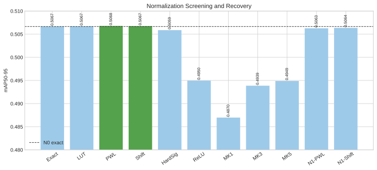

# YOLO26m Hardware-Friendly Attention 完整實驗報告

日期：2026-08-15

## 摘要

本研究只替換 YOLO26m 兩個 Attention 的 Q/K score 與 normalization path，保留 V、$PV+PE(V)$、output projection、PSABlock residual/FFN，以及外層 C2PSA/C3k2/Detect。主線在完整 COCO2017 上完成 52 個 queue jobs，最終 Queue 選出 Hadamard MDB、power-of-two scale、decomposed 2D relative bias 與 power-of-two normalization 的 N1-SHIFT，記為 A-FINAL。

| 模型 | mAP50-95 | mAP50 | mAP75 | 相對本地 baseline |
|---|---:|---:|---:|---:|
| B26-FP local baseline | 0.517998 | 0.690713 | 0.566671 | 0 |
| A-FINAL / N1-SHIFT | 0.506357 | 0.676940 | 0.554142 | -0.011641 |

A-FINAL 保留 baseline 的 97.75% mAP，下降 1.164 AP。它不是官方 YOLO26m 公布的 0.525/0.531，也不是官方 COCO API 結果；這是本 repository 使用相同 val2017 images 得到的 Ultralytics internal metric。完整 baseline 差異見 `../docs/research/yolo26m-baseline-verification.md`。

## 最終模型結構

正式修改同時命中：

- `model.10.m.0.attn`
- `model.22.m.0.1.attn`

每個 Attention 的資料流為：

~~~text
X
├─ modular Q projection ─→ Q ─→ normalized Hadamard MDB ─→ sign/STE ─┐
├─ modular K projection ─→ K ─→ normalized Hadamard MDB ─→ sign/STE ─┤
│                                                                       ├─ binary score
├─ modular V projection ─────────────────────────────────────────→ V    │
│                                                                       ↓
│                                    PoT scale + decomposed 2D bias
│                                                                       ↓
│                                   power-of-two normalization → P
│                                                                       ↓
├──────────────────────────────────────────────────────────────────→ P × V
│                                                                       │
└────────────────────────────────────────────────────────────────→ PE(V)
                                                                        ↓
                                                                  PV + PE(V)
                                                                        ↓
                                                                   Projection
                                                                        ↓
                                                         PSABlock residual + FFN
~~~

外層 C2PSA/C3k2、CSP split/concat、Detect 均未修改。P0 對兩個 Attention 與兩個外層 module 的最大絕對誤差是 $1.907\times10^{-6}$，低於 $10^{-4}$ gate；decoded output 的診斷誤差是 $1.373\times10^{-4}$。

## 實驗流程與結果

### Architecture screening

| Run | Basis | mAP50-95 | 相對 baseline |
|---|---|---:|---:|
| I-SCR | Identity binary QK | 0.492482 | -0.025515 |
| H-SCR | Hadamard MDB | **0.495243** | -0.022755 |
| T5-SCR | T5 residual approximation | 0.492907 | -0.025091 |

Hadamard MDB 勝出，但 10-epoch screening 仍比 baseline 低 2.276 AP。這證明 binary QK 需要 recovery，不能把 screening 值當正式模型。

### Direct vs Progressive recovery

| Run | 訓練方式 | 完成 epoch | mAP50-95 |
|---|---|---:|---:|
| W-DIR | epoch 0 起全 binary | 26/40 | **0.507457** |
| W-PROG | FP score 漸進混到 binary | 11/40 | 0.502866 |

Direct 高 0.004592，即 0.459 AP；Progressive 沒有帶來優勢。兩者都因 patience 5 early stop，Direct 的 best epoch 是 21，Progressive 是 6。

### Scale ablation

| Run | Scale | mAP50-95 |
|---|---|---:|
| V1-DYN | dynamic | **0.507457** |
| V1-SHEAD | static per-head | 0.506879 |
| V1-P2 | power-of-two | 0.506952 |

V1-P2 相對 dynamic 只低 0.000506，落在 0.001 tie band，因此以硬體較簡單的 PoT scale 進入 bias 階段。這是精度/成本 gate，不代表 PoT 的 mAP 絕對最高。

### Relative position bias

| Run | Bias | mAP50-95 |
|---|---|---:|
| V1-B0 | none | 0.505416 |
| V1-BD | dense 2D | **0.506877** |
| V1-BR | decomposed 2D | 0.506658 |

Dense 2D 最高，但 decomposed 2D 只低 0.000219，仍在 tie band，且結構更容易實作，因此 V1-BR 被選為 A0。不要把 V1-BR 寫成純精度 winner；它是精度接近時的複雜度 winner。

### Normalization zero-train screening

| Run | 方法 | mAP50-95 | 相對 N0-EXACT |
|---|---|---:|---:|
| N0-EXACT | exact Softmax | 0.506658 | 0 |
| N0-LUT | exponential LUT | 0.506700 | +0.000043 |
| N0-PWL | piecewise linear | **0.506772** | +0.000114 |
| N0-SHIFT | power-of-two | 0.506746 | +0.000089 |
| N0-HSIG | hard sigmoid approximation | 0.505872 | -0.000786 |
| N0-RELU | ReLU normalization | 0.494964 | -0.011694 |
| N0-MK1 | Multimax Top-1 | 0.486970 | -0.019688 |
| N0-MK3 | Multimax Top-3 | 0.493864 | -0.012793 |
| N0-MK5 | Multimax Top-5 | 0.494888 | -0.011769 |

LUT/PWL/SHIFT 都沒有造成可見掉點；微小正增益應視為 evaluator/近似擾動，不宣稱方法提升準確度。ReLU 與 Multimax 明顯掉點，不適合作主線。HardSigmoid 接近 gate 邊緣，但仍被 PWL/SHIFT 支配。

### N1 probability-level recovery

| Run | Parent | mAP50-95 | 對應 N0 | 變化 |
|---|---|---:|---:|---:|
| N1-PWL | N0-PWL | 0.506268 | 0.506772 | -0.000504 |
| N1-SHIFT | N0-SHIFT | **0.506357** | 0.506746 | -0.000390 |

兩個 N1 都比 zero-train parent 低。因此目前證據不支持「PMP recovery 必要」；更合理的後續設計是讓 N0 parent 與 N1 child 同時進 final selection。現行 Queue 只把 N0-EXACT 與 N1 children 放入 normalization final selection，因此 A-FINAL 是流程定義下的 winner，不是所有已量測 normalization 中的最高 mAP。

### BDCN branch

| 階段 | Run | mAP50-95 | Row-sum max error |
|---|---|---:|---:|
| D0 | fixed exponential | 0.503184 | $5.96\times10^{-8}$ |
| D1 5 ep | shared | 0.498984 | $5.96\times10^{-8}$ |
| D1 5 ep | per-Attention | 0.499126 | $5.96\times10^{-8}$ |
| D1 5 ep | per-head | 0.498880 | $5.96\times10^{-8}$ |
| D1 staged 10 | shared | **0.500098** | $5.96\times10^{-8}$ |
| D1 staged 10 | per-Attention | 0.500055 | $5.96\times10^{-8}$ |
| D1 staged 10 | per-head | 0.499842 | $5.96\times10^{-8}$ |
| D1 seed 1 | shared | 0.475014 | $5.96\times10^{-8}$ |
| D2 | float table | 0.500098 | $5.96\times10^{-8}$ |
| D2 | 1-PoT | 0.500088 | $5.96\times10^{-8}$ |
| D2 | 2-PoT | 0.500066 | $5.96\times10^{-8}$ |
| R0 | exact reciprocal | 0.500088 | $5.96\times10^{-8}$ |
| R1 | reciprocal LUT | 0.499812 | 0.001907 |
| R2 | nearest-PoT shift | 0.004872 | 0.414063 |

結論如下：

- Global/shared 在 0.001 tie band 內最簡單，因此勝出；三個 seed-0 sharing 方法非常接近。
- Seed 1 比 seed 0 低 0.025084，BDCN learned branch 尚不穩定，不能用單一 seed 宣稱普遍有效。
- 1-PoT/2-PoT table projection 幾乎無損；1-PoT 被選中。
- R1 相對 R0 只低 0.000275，row error 0.001907，通過既定 0.002 mAP loss 與 0.01 row-error gate，是 BDCN denominator 的可行硬體候選。
- R2 在修正 learned-codebook state transfer 後仍崩潰，確認是方法精度失敗，而不是 checkpoint reset bug。它只保留為 division-free accuracy lower bound。
- 整個 BDCN branch 低於 N1-SHIFT 約 0.006545，因此沒有進入 A-FINAL。

BDCN 的 distance-indexed normalization 核心接近 IntAttention/IndexSoftmax，不能宣稱為本研究首次提出；可研究的差異是 Binary-QK 條件、sharing/PoT projection/denominator ablation 與 fused bucket-$PV$ 組合。

## 運算量分析

修正後的 profiler 使用兩個 Attention sites、每處 400 tokens、4 heads、key dim 32、value head dim 64、32-bit packed word 的固定假設。實際兩個 checkpoint module 的 heads/key/head dim 均與假設一致。

| 方法 | Estimated memory traffic | Arithmetic cost proxy |
|---|---:|---:|
| Exact binary attention | 2,764,800 | 91,910,400 |
| LUT | 2,764,800 | 88,070,400 |
| PWL | 2,764,800 | 89,350,400 |
| SHIFT / A-FINAL | **2,764,800** | **86,790,400** |
| BDCN D2-1P exact denominator | 4,556,800 | 90,092,800 |
| BDCN R1 reciprocal LUT | 4,556,800 | 90,070,400 |
| BDCN R2 PoT denominator | 4,556,800 | 90,064,000 |

以同一 proxy 計算，A-FINAL 相對 exact binary normalization 下降 5.57%，memory proxy 不變。舊版少算 Hadamard MDB 的第二個 binary basis；這次已用 regression test 修正。所有同階段候選共用這項常數，winner 排名不變。BDCN 雖不 materialize dense P，但 histogram/bucket-value accumulation 與 16-level buffer 使目前 memory proxy 高於 dense normalization。

`operation_counts` 保存多條替代 reference，不能全部相加；新 `selected_operation_counts` 才列出 variant 實際選用項。SHIFT 中保留的 dense $PV$ 占總 proxy 94.4%，所以 normalization 簡化不能直接解讀成整個 Attention 或 YOLO26m 加速 5.57%。公式、逐項數字、checkpoint 大小及理論 bit-width payload 見 [COMPUTE_AND_SIZE.md](COMPUTE_AND_SIZE.md)。

## 參數與 checkpoint

- 官方未融合 YOLO26m：21,896,248 parameters。
- A-FINAL/N1-SHIFT：21,897,260 parameters。
- 增量：1,012 parameters，主要來自 decomposed 2D bias。
- A-FINAL checkpoint：`artifacts/runs/n1-shift/ultralytics/weights/best.pt`。
- SHA-256：`6bd4b25ea36bfe453f437cec6647d7d7dbab745e1e0035b1610928a454e63ce1`。
- A-FINAL parameter tensor payload：41.77 MiB（FP16）；checkpoint file：68.26 MiB。

目前 A-FINAL 尚未建立最新 BN-fold export、ONNX、bit-true 或 FPGA reference artifact；因此 checkpoint 是演算法研究權重，不是已驗收硬體部署包。

訓練中間產物已依核准清理，只保留五個階段 winner checkpoint；詳見 [CLEANUP.md](CLEANUP.md)。

## 最終判定

1. Binary QK 主線可行：A-FINAL 保留 97.75% 本地 baseline mAP，且只增加 1,012 parameters。
2. Hadamard MDB、Direct recovery、PoT scale、decomposed bias 都有目前實驗支持。
3. Normalization 最強證據是 zero-train PWL/SHIFT 幾乎無損；N1 recovery 沒有改善，不應宣稱必要。
4. BDCN 的 1-PoT table 與 reciprocal LUT 可行，但 learned codebook 有明顯 seed instability，且整體精度低於主線。
5. R2 division-free normalization 不可用於正式模型。
6. 現階段完成的是演算法與 analytical proxy，不是硬體實測，也不是 optional quantization 結論。

## 下一步建議

不啟動量化前，建議先完成兩件低風險確認：

1. 將 N0-SHIFT 保留為 N1-SHIFT 的 no-recovery 對照，修正 final selection 不丟棄較好的 parent。
2. 使用 canonical COCO API/faster-coco-eval 對 B26-FP、N0-SHIFT、N1-SHIFT、R1-RLUT 各重評一次，並補至少兩個 A-FINAL seeds。

完成後若老師決定繼續，才進 Optional Phase Q：先 PTQ sensitivity，再依 gate 決定是否只對 1–2 個候選做 QAT；5/6/7-bit、ternary、SD4 應各自報告，不混成同一條 uniform-bit 曲線。
