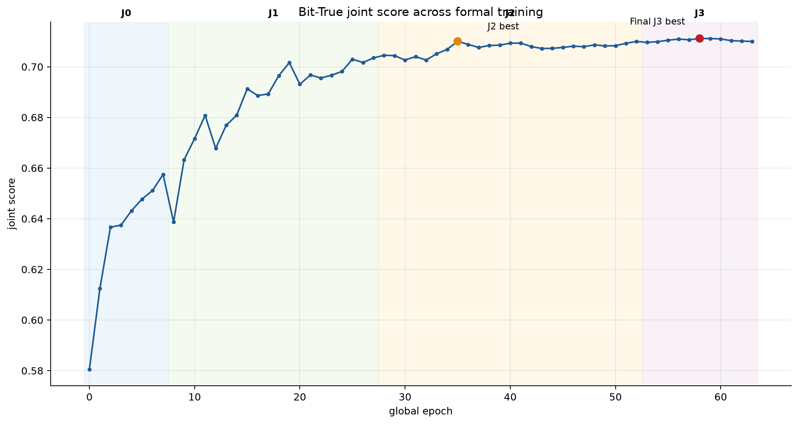
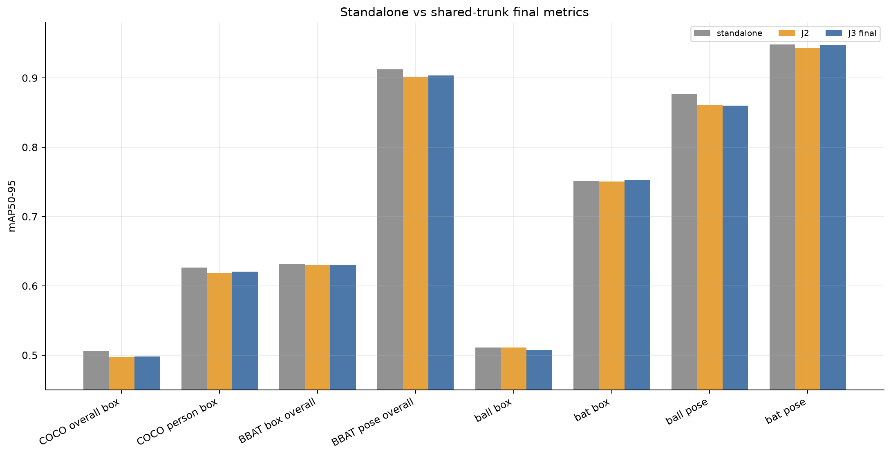
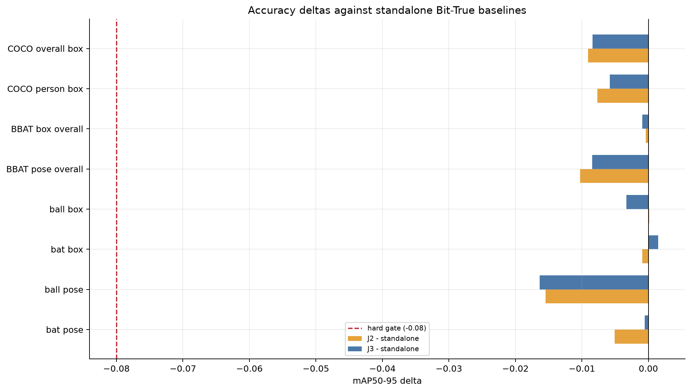
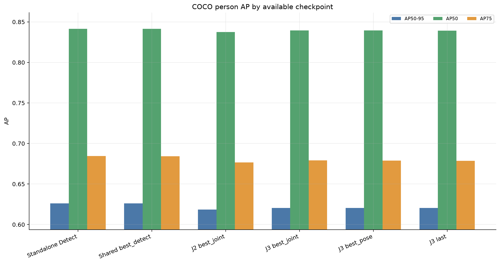
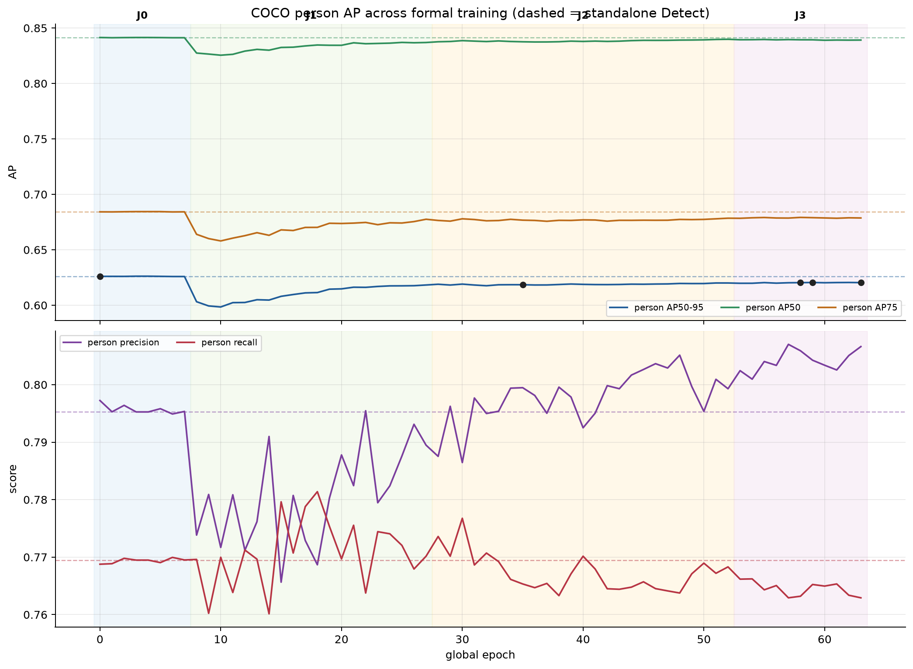
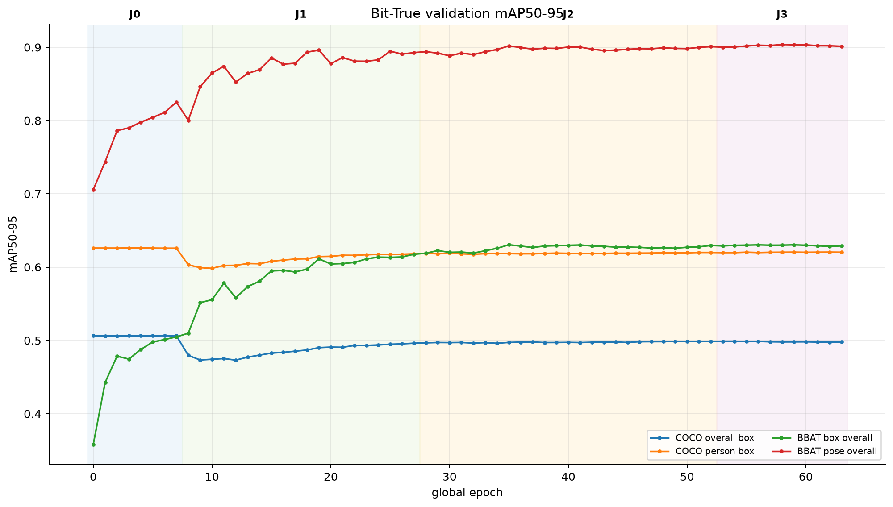
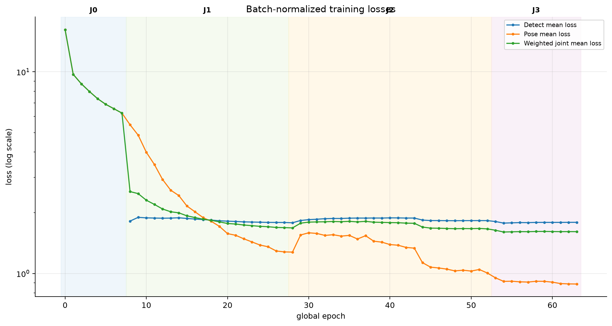
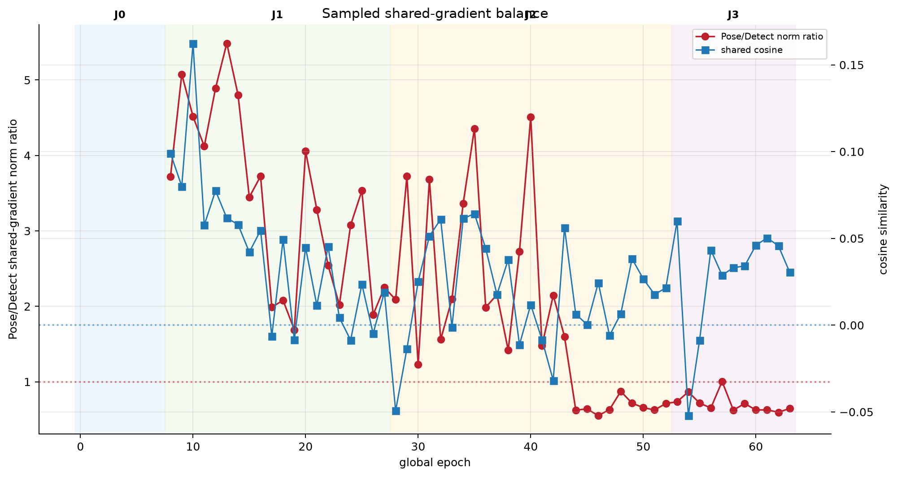

# Full35 Detect＋Pose 融合訓練最終分析

## 結論先行

Full35 seed0 的正式 J0→J3 訓練與獨立 Float／Bit-True 驗證已完成。依固定實驗selector接受的是
**J3 global epoch 58**（J3 內第6個epoch，zero-based 5）的 `best_joint.pt`：Bit-True
joint score 為 `0.711174738975`，高於 J2 best 的 `0.710038215928`，絕對改善
`+0.001136523048`。八項 mAP50-95 hard gate 全部通過；最差是 ball pose
相對獨立模型 `-0.016354`，仍遠高於
`-0.08` 下限。

這代表共享模型在本次 seed0 可以把兩個 standalone trunk 合成一份，參數由
45,580,762 降為 26,529,701（少 19,051,061，`41.796%`），同時將八項精度下降控制在
允許範圍內。它不代表每項都比 J2 或獨立模型更好，也不代表 latency、energy 或 FPGA
資源已改善；這些邊界在後文分開說明。

這個「接受」只代表實驗的joint-score預設。依使用者最新要求，實際部署要用
`best_detect`、`best_joint`、`best_pose`、`last`或獨立Detect，仍保留到看完下方COCO
person AP後再決定；本次沒有更換或刪除任何權重。



## 實際使用的資料與模型

- Detect：`/home/uxin/yolo/coco2017.yaml`，COCO80 train/val 118,287/5,000；應用層取 person，
  正式驗證同時保留 COCO overall 與 person 指標。
- Pose：canonical `bbat5-v1` 的 `configs/pose.yaml`，formal train/val 5,964/683，類別
  ball/bat，`kpt_shape=[2,3]`，visibility 0/2 由原生 Pose26 loss處理。
- 本次正式 run 全程 `fraction=1`，兩個資料集都使用；沒有使用歷史 basic split，沒有把
  Detect/Pose label粗暴合成同一loader。
- 架構：Full35 shared YOLO26m layers 0–22只執行一次，P3/P4/P5同時餵 COCO80 Detect head
  與 ball/bat Pose26 head。不是兩個完整模型串行forward，也不是權重平均。

## 最終八項結果

正式選模只用 Bit-True backend；Float 用來檢查部署數值一致性。`0.08` 是「絕對
mAP50-95 下降上限」，不是百分比。

| 指標 | 獨立模型 | J2 | 最終 J3 | J3−獨立 | J3−J2 | gate |
| --- | ---: | ---: | ---: | ---: | ---: | :---: |
| COCO overall box | 0.506401 | 0.497346 | 0.498022 | -0.008379 | +0.000677 | 通過 |
| COCO person box | 0.626186 | 0.618511 | 0.620381 | -0.005804 | +0.001870 | 通過 |
| BBAT box overall | 0.630964 | 0.630566 | 0.630036 | -0.000928 | -0.000531 | 通過 |
| BBAT pose overall | 0.912161 | 0.901884 | 0.903717 | -0.008443 | +0.001833 | 通過 |
| ball box | 0.510747 | 0.510866 | 0.507437 | -0.003310 | -0.003429 | 通過 |
| bat box | 0.751180 | 0.750266 | 0.752634 | +0.001454 | +0.002368 | 通過 |
| ball pose | 0.876263 | 0.860799 | 0.859909 | -0.016354 | -0.000890 | 通過 |
| bat pose | 0.948058 | 0.942970 | 0.947526 | -0.000532 | +0.004556 | 通過 |





J3並非全項勝過J2：ball box `-0.003429`、
ball pose `-0.000890`，但 person、BBAT overall pose、
bat box與bat pose改善，固定joint score因此選J3。不能用joint平均掩蓋任一任務失敗，所以
先逐項套八項gate，再比較joint score。

## COCO person AP與可選權重

下表全部使用同一個COCO2017 val 5,000張、同一套Bit-True evaluator。`AP50-95`是person
單類別在IoU 0.50:0.95的平均AP；`AP50`與`AP75`分別固定IoU 0.50／0.75。precision與
recall是validator選定操作點的值，不是AP，不能和AP欄直接相加。

| 候選 | epoch | person AP50-95 | AP50 | AP75 | precision | recall | AP50-95差於獨立Detect | joint score | 八項gate |
| --- | ---: | ---: | ---: | ---: | ---: | ---: | ---: | ---: | :---: |
| Standalone Detect | — | 0.626186 | 0.841473 | 0.684441 | 0.795257 | 0.769484 | +0.000000 | — | 不適用 |
| Shared best_detect | 0 | 0.626057 | 0.841464 | 0.684228 | 0.797245 | 0.768767 | -0.000129 | 0.580499 | 未通過 |
| J2 best_joint | 35 | 0.618511 | 0.837604 | 0.676728 | 0.799476 | 0.765334 | -0.007674 | 0.710038 | 通過 |
| J3 best_joint | 58 | 0.620381 | 0.839410 | 0.679218 | 0.805898 | 0.763199 | -0.005804 | 0.711175 | 通過 |
| J3 best_pose | 59 | 0.620513 | 0.839392 | 0.678979 | 0.804254 | 0.765241 | -0.005673 | 0.711142 | 通過 |
| J3 last | 63 | 0.620398 | 0.839157 | 0.678712 | 0.806627 | 0.762921 | -0.005787 | 0.709974 | 通過 |





這些數字對選擇的意義如下：

- **只在意person、可接受不融合**：獨立Detect的person AP50-95最高，為
  `0.626186`；但它沒有ball/bat Pose head，
  也不享有shared trunk的一次feature extraction。
- **只跑shared模型的Detect head**：`best_detect.pt`為global epoch0，person AP50-95
  `0.626057`，只比獨立Detect低
  `0.000129`。
  但當時Pose仍未適應完成，八項gate未通過，所以不能拿它作`task=both`正式答案。
- **兩個head都要、以固定joint score為準**：目前預設仍是J3 `best_joint.pt`。它的person
  AP50-95為`0.620381`，比J2 best_joint高
  `+0.001870`，
  且八項gate全部通過。
- **兩個head都要、略偏Pose與person recall**：J3 `best_pose.pt`的person AP50-95為
  `0.620513`，比best_joint高
  `+0.000131`，
  recall也高
  `+0.002041`；
  但precision低
  `-0.001644`，
  joint score低`-0.000033`。
  差距很小，只有seed0時不應宣稱具有統計顯著性。
- **要stage-complete端點**：`last.pt`的person precision最高，為
  `0.806627`，但joint score已回落到
  `0.709974`，因此只適合作續訓／端點比較，不是目前首選。

`Standalone Detect`、J2/J3 `best_joint`另有獨立final revalidation；`best_detect`、
`best_pose`與`last`使用訓練當下保存的完整COCO Bit-True逐epoch validation。兩者資料、
evaluator與backend一致，但若要在極小差距上做不可逆部署決策，仍建議對最後兩個候選
各做一次同指令重驗或跑seed1。目前交付預設不變，等使用者選定後再改正式入口。

## 為什麼更換訓練方式

第一版融合一開始就解凍neck、MASF與兩個heads。Pose head原本配合獨立Pose P3 trunk，
融合時shared trunk卻由Detect checkpoint初始化，兩者初始feature分布不完全匹配。舊版
shared-gradient初期24次抽樣中，Pose/Detect norm平均比為
`19.69×`
（範圍`6.24–80.95×`），
平均cosine `0.0498`，其中
`7/24`次為負。
把舊run全部`66`次durable抽樣都納入後，ratio平均降為
`12.65×`，表示後段有所緩和，但初期失衡確實存在。
這比較像Pose梯度量級壓過Detect，而不是兩個任務始終完全反向。

舊J1的COCO overall delta在warmup附近由epoch1 `-0.0813`惡化到epoch3 `-0.1855`，LR下降後
又恢復到epoch5 `-0.0848`，呈現learning-rate overshoot。若neck一解凍就不可逆破壞，後段
通常不會這樣恢復。因此新版沒有只增加epoch，而是先解決初始化失配、梯度量級與更新範圍。

新版採下列順序：

| stage | 實跑 | 目的 | trainable scope | peak LR |
| --- | ---: | --- | --- | --- |
| J0 | 8/8 | Pose head適應Detect shared trunk | 只開Pose head | Pose head `2e-4` |
| J1 | 20/20 | 保守開始雙任務融合 | neck＋兩heads | neck `7.5e-5`、heads `2e-4` |
| J2 | 25/80 | 再讓後段shared feature協調 | backbone layer9+、neck、MASF、兩heads | `1.5e-5/7.5e-5/1.5e-4/2e-4` |
| J3 | 11/20 | 全backbone與attention可微部分低LR refinement | full backbone、neck、MASF、attention可微部分、兩heads | `3.8e-6/1.9e-5/3.8e-5/5e-7/5e-5` |

J2在8個stale epochs後只做一次LR×0.5，之後以patience17停止；J3在global epoch58創新高後
連續5次沒有超越，以patience5於epoch63正常停止。這就是J2只跑25而非80、J3只跑11而非20
的原因，不是訓練中斷。





## 正式訓練設定

- optimizer：AdamW；`weight_decay=0.00027`、`betas=(0.948,0.999)`。本run不在中途改成
  MuSGD；MuSGD保留為未執行challenger，避免同時改optimizer與stage策略而無法歸因。
- scheduler：各stage cosine；J0/J1/J2 warmup 1 epoch，J3 warmup 3 epochs。
- loss：Ultralytics 8.4.90原生Detect/Pose26 E2E、progressive、RLE與visibility loss；
  criterion schedule每joint epoch更新一次。
- task權重：Detect/Pose=`1.0/0.25`；J0只有Pose active時重新正規化，不會再乘0.25。
- macro：2個logical Detect128＋1個Pose16，影像exposure 256:16；各microbatch順序
  forward/backward，最後才clip(max norm10)、optimizer step、scaler與EMA update。
- augmentation：Detect/Pose都mosaic0；Detect fliplr0.5，Pose fliplr0，避免尚未證明的
  bat endpoint交換語意。
- BN：shared backbone/neck running statistics固定；head BN維持train。
- backend：Float訓練；每epoch Float與Bit-True各驗一次，Bit-True負責gate與checkpoint selector。
- XNOR：`tiled_exact`、token tile32、`qk_ste=false`；bit-true XNOR是必須契約。

本輪共完成`64`個validation epochs、`28,912`次optimizer
macro-step，訓練看過`6,624,072`張Detect exposure與
`462,336`張Pose exposure（含Pose loader cycle，不是unique image數）。



## 遇到的問題、根因與解法

1. **舊策略初期精度大跌**：Pose head與Detect trunk失配，加上Pose shared-gradient較大、
   neck/head LR偏高。解法是J0 head-only適應、延後解凍、task weight降為0.25並降低LR；
   不是單純無限增加epoch。
2. **原始XNOR validation OOM 5.94GiB**：untiled boolean equality的int64 reduction workspace
   為`O(B·H·N²·D·8)`；val batch32、rect672時單一workspace就5.935GiB。改成query/key token
   tile32的exact reduction，逐值與既有gradient semantics測試一致，保留bit-true XNOR。
3. **physical Detect batch128 OOM**：空卡RTX5090第一個正式forward已用30.58GiB，仍需
   400MiB。保留使用者要求的logical128，但J1/J2用physical64×2；這維持每次update exposure，
   不宣稱head BN與microbatch loss逐值等同physical128。
4. **J3 physical64再次OOM**：full unfreeze第一個forward程序已用30.74GiB，只剩209MiB。
   J3改physical32×4，logical128不變；實跑約21GiB並完成全程。
5. **起始AMP overflow**：初始scale65536造成多組參數Inf/NaN。新增參數級診斷及同macro
   replay，GradScaler先skip step、降scale、清gradient；成功前不前進EMA/scheduler/loader。
   第一個正式macro重算12次後於scale16成功，沒有silent bad step。
6. **正式trainer漏`import math`**：啟動即NameError。保留失敗artifact，先加CPU regression
   test，再補最小import；後續完整suite通過。
7. **J2平台期**：不是直接改momentum。依事前策略，stale8只降一次LR×0.5，stale17停止；
   best epoch35與last epoch52 joint score只差`0.0000226`，顯示已在平台附近。
8. **J3 checkpoint銜接**：J2 best位於stage中途，不帶`stage_complete=true`；用它resume會
   繼續J2。故J3從分數近似且stage已完成的J2 last exact-resume，另以J2 best作必須超越的
   acceptance reference，兩個run完全分開。

## Float／Bit-True一致性

J3 final八項Float與Bit-True的最大絕對差為
`0.00042315`。這支持目前Float訓練結果在
Bit-True attention backend下沒有明顯數值落差；它仍不是FPGA bitstream或HLS實測。

## 交付、復現與證據

- 正式推論權重：`final/full35/weights/combined/inference/best_joint.pt`。
- exact-resume最佳權重：`final/full35/weights/combined/full-resume/best_joint.pt`。
- J3終點：`final/full35/weights/combined/full-resume/last.pt`。
- J2 rollback：`final/full35/weights/rollback/j2/`。
- 原始CSV/JSONL/PNG：`final/full35/outputs/training/`。
- 最終Float/Bit-True完整metrics與predictions：
  `final/full35/outputs/validation/accepted-best-joint/`。
- 本報告機器可讀資料：`SUMMARY.json`及`data/*.csv`。

```bash
# 驗證交付包每個檔案SHA256
.venv/bin/python final/full35/verify.py

# 正式雙backend重驗
.venv/bin/python final/full35/run.py validate \
  --checkpoint final/full35/weights/combined/inference/best_joint.pt \
  --backend both --device 0 --name final-recheck

# shared feature只抽一次的both推論
.venv/bin/python final/full35/run.py infer \
  --checkpoint final/full35/weights/combined/inference/best_joint.pt \
  --source /path/to/image.jpg --task both --device 0 \
  --output-json final/full35/outputs/inference.json
```

## 限制與下一步

- 目前只有seed0，正式跨seed穩定性仍屬provisional；若時間允許，下一個最有價值的精度
  實驗是鎖定本recipe跑seed1，不是再用seed0挑超參數。
- Q/K binary sign與`score.gamma`因bit-true硬體契約保持凍結；J3所謂attention tuning是
  V、PE、projection與relative bias等可微部分，不可宣稱訓練了Q/K sign decision。
- 41.796%只是參數與weight storage減少；尚需在相同GPU設定量測latency、peak VRAM、
  throughput，再進入HLS/FPGA latency、energy、BRAM/DSP驗收。
- final不內含COCO/BBAT5影像與labels；移機時必須提供同一canonical資料與更新路徑，
  不能重新切BBAT5。
- Partial75已有隔離環境但未執行；依使用者要求，只有再次明確下令才啟動。
- 未執行任何刪除。失敗startup、physical64 J3 OOM與舊run保留作診斷證據；若要清理，應
  先另列清單與可回復性再取得授權。
