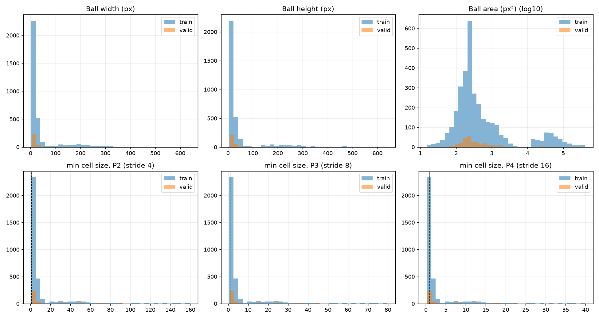
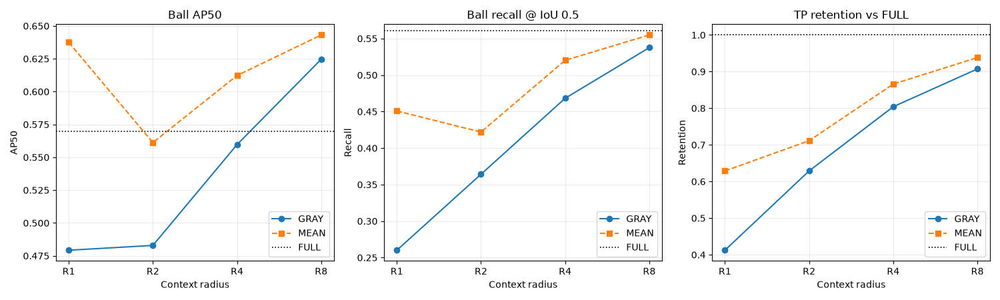
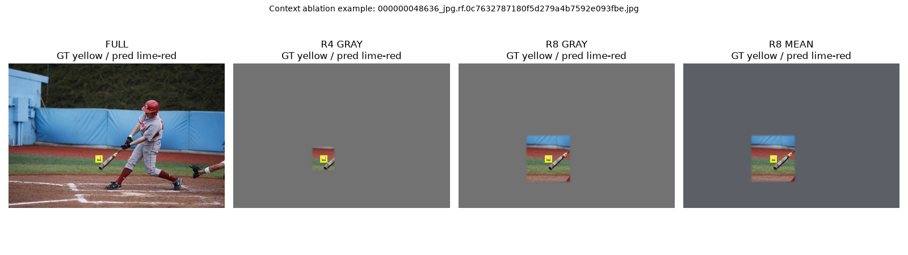

# BBT5 Context Radius 實驗報告

> 目的：以 CPU 量測 BBT5 的 ball 偵測是否需要球以外的大範圍視覺上下文，而不是重現 MASF-YOLO 或驗證 MFAM。

## 執行摘要

本報告使用 clean-valid 的 240 張影像（其中 164 張含球）與 173 個 ball targets。模型為 `yolo11m_bat_detect_init.pt`，所有 inference 使用 CPU、640 input、NMS IoU 0.7；context 外部以 GRAY 或 MEAN 遮罩。
各條件模型 inference 約 0.216 s/image（CPU；不含遮罩與分析）。Recall/TP retention 使用固定 conf=0.25；AP 使用低門檻輸出的完整 precision-recall 排序。

結論由 R1/R2/R4/R8 與 FULL 的 AP、Recall、paired TP retention 共同決定。若 R4 已接近 FULL，不能以小球尺寸本身推論需要大 receptive field；若 R8 或 FULL 仍穩定提升，才支持更大 context 的必要性。

## 1. 資料與切分

- train：6080 images；ball 3312。
- 原 valid：567 images；ball 301。
- clean-valid：240 images（含球影像 164）；ball 173；source groups 240。
- train/valid source-stem overlap：10；source-group overlap：55。

原 valid 含影片影格來源重疊，因此本報告以 clean-valid 作主要判斷，原 valid 只作參考。clean split 是依檔名的保守 source-group heuristic 建立，仍應人工抽查。

## 2. 實驗一：scale-to-cell 統計

典型 ball 的初步統計如下；完整每一個 target 在 `cell_stats.csv`。

| split | ball | bbox median | area < 32² | min side cells P2/P3/P4 |
|---|---:|---:|---:|---|
| train | 3,312 | 16×16 px | 78.4% | 3.75 / 1.88 / 0.94 |
| valid | 301 | 16×17 px | 82.4% | 3.75 / 1.88 / 0.94 |

P4 對典型 ball 已接近 1 cell；P3 約 2 cells。這是空間解析度證據，不是 context 需求證據。



對 valid 的 ball 中位數 16×17 px，context 窗口約為：R1=16×17、R2=32×34、R4=64×68、R8=128×136 px（實際每顆球依 bbox 比例不同）。


Cell 尺寸分布的摘要（`<1` 是最短邊小於 1 feature cell 的比例）：

| split | P2 median / <1 | P3 median / <1 | P4 median / <1 |
|---|---:|---:|---:|
| train | 3.75 / 0.1% | 1.88 / 5.2% | 0.94 / 54.4% |
| valid | 3.75 / 0.0% | 1.88 / 1.7% | 0.94 / 53.5% |
## 3. 實驗二：Context Radius

每張影像以所有 ball 的 R1/R2/R4/R8 窗口 union 保留，其餘區域遮罩；球的原始像素大小與位置不變。AP/Recall 只計算 ball。FULL 是同一 checkpoint 的未遮罩輸入。

| condition | AP50 | AP50-95 | P@0.25 | FP/img | Recall@0.5 | TP retention | retention 95% CI | lost FULL TP | recall 95% CI |
|---|---:|---:|---:|---:|---:|---:|---|---:|---|
| full_none | 56.97% | 32.65% | 68.31% | 0.188 | 56.07% | 100.00% | [100.00%, 100.00%] | 0 | [48.48%, 63.74%] |
| r1_gray | 47.93% | 28.16% | 86.54% | 0.029 | 26.01% | 41.24% | [29.34%, 52.58%] | 57 | [18.45%, 33.51%] |
| r2_gray | 48.29% | 28.21% | 85.14% | 0.046 | 36.42% | 62.89% | [52.22%, 73.08%] | 36 | [28.31%, 44.57%] |
| r4_gray | 55.97% | 32.40% | 84.38% | 0.062 | 46.82% | 80.41% | [70.65%, 88.17%] | 19 | [38.17%, 54.65%] |
| r8_gray | 62.46% | 34.88% | 86.92% | 0.058 | 53.76% | 90.72% | [84.54%, 96.74%] | 9 | [45.93%, 61.58%] |
| r1_mean | 63.75% | 34.15% | 96.30% | 0.013 | 45.09% | 62.89% | [52.63%, 72.92%] | 36 | [36.59%, 52.66%] |
| r2_mean | 56.12% | 32.05% | 87.95% | 0.042 | 42.20% | 71.13% | [60.87%, 80.37%] | 28 | [34.12%, 50.82%] |
| r4_mean | 61.22% | 35.58% | 86.54% | 0.058 | 52.02% | 86.60% | [79.12%, 93.14%] | 13 | [44.05%, 59.80%] |
| r8_mean | 64.31% | 36.17% | 88.07% | 0.054 | 55.49% | 93.81% | [88.54%, 98.02%] | 6 | [48.21%, 62.89%] |





## 4. 判讀

### 4.1 主要結果

- GRAY：R4 Recall 46.82% → R8 53.76%，增加 6.94 points；R8 → FULL 只增加 2.31 points。
- MEAN：R4 Recall 52.02% → R8 55.49%，增加 3.47 points；R8 → FULL 只增加 0.58 points。
- TP retention：R8 相對 FULL 為 GRAY 90.72%、MEAN 93.81%；R4 則為 GRAY 80.41%、MEAN 86.60%。
- R4→R8 的改善在兩種遮罩方向一致，且兩種遮罩都顯示 FULL 相對 R8 的 Recall 增益小於 3 points。

paired source-group bootstrap 的 Recall 差異：

- R8−R4：GRAY 6.94 points，95% CI [2.89, 11.38]；MEAN 3.47 points，95% CI [0.00, 7.56]。
- FULL−R8：GRAY 2.31 points（R8−FULL CI [-6.90, 1.69]）；MEAN 0.58 points（R8−FULL CI [-4.60, 3.01]）。

### 4.2 事前規則對照

本次資料呈現 plan **結論 B 的 point-estimate pattern：需要較大的局部 context，但沒有證據需要完整全圖 context**。換句話說，4× bbox 不足以讓結果飽和；8× bbox 已接近 FULL，額外從 8× 擴到全圖的收益很小。

證據強度是中等而非絕對：GRAY 的 R8−R4 paired CI 大致支持正向改善；MEAN 的 CI 下界接近 0，表示來源群組數量與遮罩 OOD 仍讓差異不完全穩定。因此本報告支持把約 8× bbox 當作後續設計的 context 目標，但不支持直接改寫模型或宣稱已證明某一 branch 必須保留。

這不是『大 receptive field 完全不重要』，而是目前證據支持有效 context 約需達到 8× bbox；它沒有支持把 receptive field 擴展到整個球場。

AP 在 R8 甚至高於 FULL（GRAY 62.46% vs 56.97%；MEAN 64.31% vs 56.97%），但遮罩同時改變了負背景與 false positives，因此 AP 絕對值受 intervention distribution shift 影響。本判定以 paired Recall/TP retention 為主，AP 只作輔助。

## 5. 分層結果

完整分層表在 `subgroup_metrics.csv`，用來檢查尺寸、bat 距離與不同場景是否有不同 context 飽和點。小於 30 targets 的 subgroup 只作描述。

尺寸分層的重點：8–16 px ball 在 R8 的 TP retention 為 GRAY 85.71%、MEAN 89.29%；16–32 px ball 為 GRAY 89.13%、MEAN 93.48%；>=32 px ball 在 R2 後大致飽和。這表示較大的 context 需求主要出現在小球，而不是所有物體普遍需要全圖。

bat 關係的重點：far/no-bat targets 在 R8 已接近 FULL；overlap 與 near subgroup 數量較少且 baseline TP 少，結果只作描述。

尺寸分層的數據（Recall / TP retention）：

| size bin | targets | FULL Recall | R4 GRAY retention | R8 GRAY retention | R4 MEAN retention | R8 MEAN retention |
|---|---:|---:|---:|---:|---:|---:|
| 8-16 | 57 | 49.12% | 67.86% | 85.71% | 75.00% | 89.29% |
| 16-32 | 72 | 63.89% | 78.26% | 89.13% | 86.96% | 93.48% |
| >=32 | 42 | 54.76% | 100.00% | 100.00% | 100.00% | 100.00% |

## 6. 重現方式

在本工作目錄使用同一套資料與 checkpoint：

```bash
MPLCONFIGDIR=/tmp/field-check-mpl-cache CUDA_VISIBLE_DEVICES='' ../../.venv/bin/python context_rf_experiment.py audit --out context_rf_cpu
../../.venv/bin/python context_rf_experiment.py infer --condition r4 --mask gray --out context_rf_cpu --start 0 --limit 120 --suffix _p0
../../.venv/bin/python context_rf_experiment.py merge --condition r4 --mask gray --out context_rf_cpu
../../.venv/bin/python context_rf_experiment.py analyze --out context_rf_cpu --bootstrap 1000
```

實際執行時對 R1/R2/R4/R8 與 GRAY/MEAN 各自分片推論，再 merge；9 個合併 prediction files 均包含 240 張 clean-valid 影像。

## 7. 限制

1. 這是 oracle-centered context ablation：遮罩範圍由 ground-truth ball bbox 決定，不是部署時可直接使用的演算法。
2. 遮罩會造成 distribution shift；GRAY 與 MEAN 若趨勢不一致，不能下 receptive-field 結論。
3. checkpoint 是由 pose checkpoint 轉換而來，並非獨立 detect retraining；結果限定於該模型。
4. Context Radius 能量測輸入上下文需求，不能直接定位某一個 layer、branch 或 channel。

## 8. 產物

- `data_audit.json`、`cell_stats.csv`、`targets.csv`、`clean_valid.txt`
- `predictions_*.json`
- `context_metrics.csv`、`subgroup_metrics.csv`
- `cell_distributions.png`、`context_curves.png`、`context_examples.png`

最後更新：由 `context_rf_experiment.py analyze` 自動產生。
