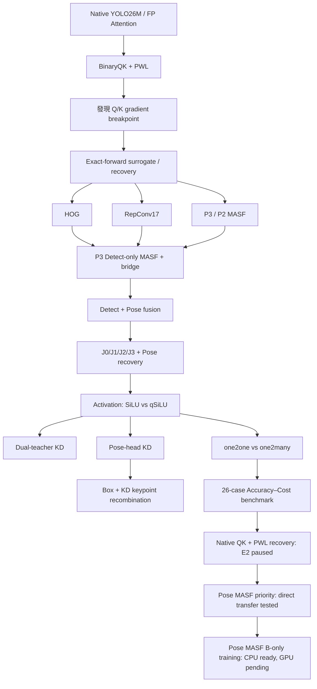
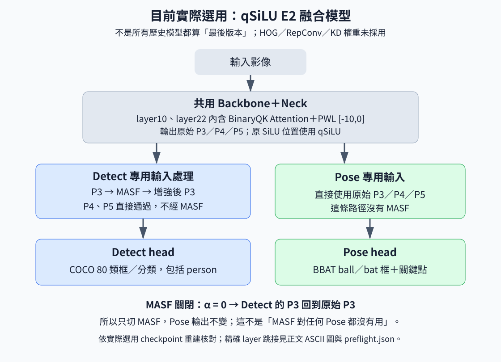
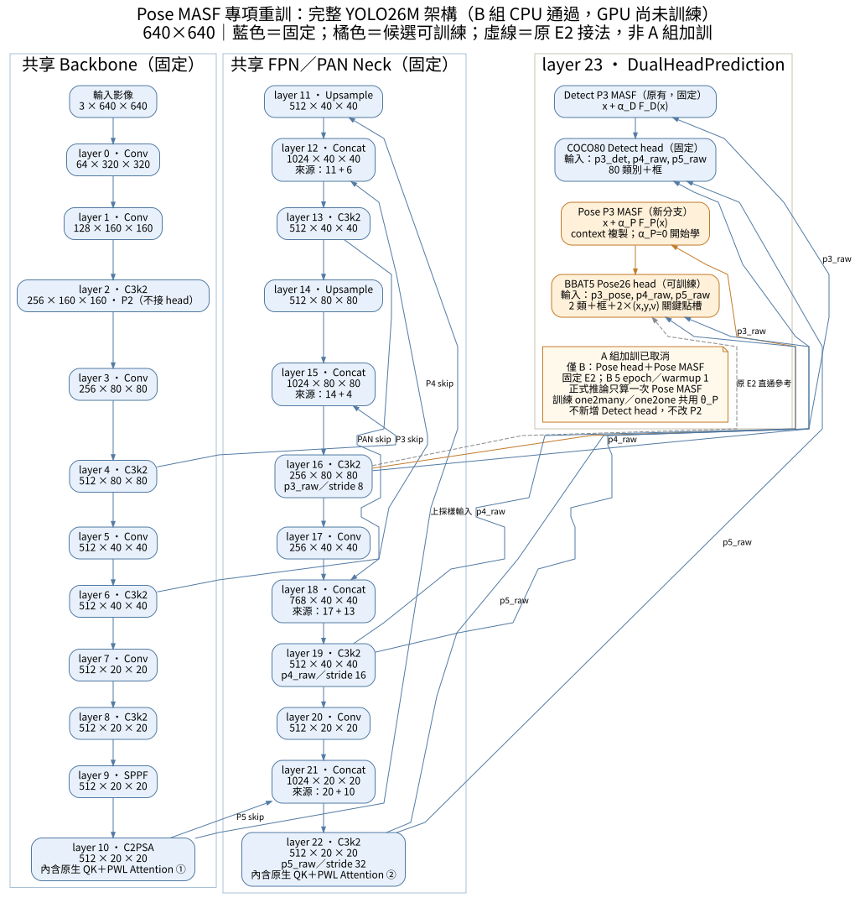
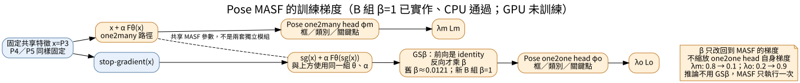

# YOLO26M Optimize 完整研究報告：從 BinaryQK 到 Detect–Pose 融合、Activation、KD 與推論最佳化

> **閱讀對象：教授、論文審查、專題口試。** 本文不是 Git worklog 的逐日摘要，而是把整個 `yolo_optimize` 改寫成「研究問題 → 假說 → 對照實驗 → 結果 → 決策 → 限制」的研究敘事。
>
> 最新資料基準：`main` commit `31e6b16a5b08c1a661203f70ee25fcaa471a4c53`（`5090 Done 0913`）。本文不新增 AP，不把尚未執行的計畫寫成成果。所有 AP 若未特別標示，均為 AP50–95、0–1 尺度。

---

## 摘要

本研究以 YOLO26M 為核心，目標是在保留物件偵測與 ball／bat Pose 任務精度的前提下，探索可朝硬體實作靠攏的 Attention、Activation、多任務融合與推論策略。研究不只追求單一最高 AP，而是持續回答三個問題：

1. **硬體友善近似會損失多少精度，損失能不能透過訓練修復？**
2. **Detect 與 Pose 共用 backbone／neck 時，如何減少任務互相干擾？**
3. **增加的模組是否真的帶來足夠收益，還是只增加 Params、MAC、latency 與研究複雜度？**

研究從 BinaryQK 與 PWL Softmax 開始。BinaryQK 將 Attention 的 Q/K 相似度改成二值表示，並搭配 Hadamard 第二分支、固定尺度與相對位置偏置；但正式離散 score 曾造成 Q/K 梯度路徑失效，因此後續建立「前向保持 BinaryQK 語意、反向提供 surrogate gradient」的訓練機制。之後依序測試 HOG 輔助、RepConv、P3/P2 MASF、Detect-only P3 MASF 與 gradient bridge，再將 COCO Detect 與 BBAT Pose 整合成共享特徵的雙任務模型。融合後再比較 SiLU／qSiLU、雙教師 KD、Pose-head KD、關鍵點分支重組與 one2one／one2many 推論路徑，最後建立 26 組 Accuracy–Cost benchmark。

截至最新版本，有兩個重要後續：

- **Native QK＋PWL recovery 已實際執行到 E2 並安全暫停。** E2 多數 AP 尚未超過原 qSiLU BinaryQK E2；因只到 E2 且依使用者要求暫停，不能將它寫成 Native QK 的最終失敗。
- **Pose MASF priority 已完成全量比較。** 直接把 Detect 端 MASF 複製到 Pose P3，overall Pose 幾乎不變、ball keypoint 微升、bat keypoint 微降，且增加 75,777 參數、0.475136 GMAC，故不直接取代原 Pose。Pose MASF B-only 專項訓練只完成 CPU 前置，GPU 尚未啟動。

因此目前最合理的研究定位是：`yolo_optimize` 作為 **各子方向 winner 的 integration / Pareto validation layer**，不是所有新想法都直接堆到同一模型。

---

# 1. 研究背景與核心問題

## 1.1 為什麼不是只做「更高 AP」？

原生 YOLO26M 精度好，但若目標是 FPGA、ASIC、NPU 或低成本邊緣平台，Attention dot-product、Softmax、SiLU、雙模型部署與 FP32 權重都可能形成硬體成本。因此研究的目標不是單純把模型壓小，而是回答：

- 哪些運算真的需要硬體近似？
- 近似後的 accuracy loss 能不能追回？
- 多任務融合是否真的比兩套模型更值得？
- 一個「增準模組」增加的 MAC 是否值得？
- 軟體 GPU 慢，是否代表硬體公式沒有價值？

## 1.2 optimize 內涵蓋的研究方向

| 方向 | 核心問題 | 代表方法 |
| --- | --- | --- |
| Attention hardware approximation | Q/K dot-product、Softmax 如何簡化？ | BinaryQK、Hadamard、fixed scale、PWL |
| Accuracy recovery | 近似後精度如何追回？ | surrogate、HOG、KD、gradient bridge |
| Detect＋Pose fusion | 共享特徵如何避免任務互相干擾？ | P3 bridge、freeze policy、J0/J1/J2/J3 |
| Activation | 非線性如何硬體導向？ | qSiLU、Hardswish、PolyShift |
| Inference | head routing 能否提高精度／降低成本？ | one2one、one2many＋NMS |

**BinaryQK 不等於完整 weight quantization。** W8、LS-SD4、LSQ、layer sensitivity、PTQ/QAT 屬於 `yolo_quantize` 主線，應在後續 Pareto integration 再接進來。

---

# 2. 資料、任務與評估契約

| 項目 | 固定設定 |
| --- | --- |
| COCO80 | train 118,287；val 5,000 |
| person | COCO class 0，沒有另外重切 person-only dataset |
| BBAT5 | train 5,964；val 683 |
| BBAT classes | ball=0、bat=1 |
| Pose keypoints | 2 個 keypoints，`kpt_shape=(2,3)` |
| 常用 input | 640×640 |
| 主要 backend | Float-PWL／BitTrue-PWL 分列 |
| 軟體 | Ultralytics 8.4.90、Torch 2.11.0+cu128 |
| GPU | RTX 5090 |

所有表格若未另述均為 AP50–95。+0.005 等於 +0.5 個百分點，不是 +5%。COCO sports ball/baseball bat 與 BBAT ball/bat 是不同資料與 label space，不能混比。

此外必須區分：

- training safety stop
- stage-relative gate
- final fusion acceptance gate

`best_joint` 只代表某一 run 的 selector，不代表全歷史全指標冠軍。

---

# 3. 全研究流程



整條研究主線的原則是：**每一輪只回答一個主要因果問題，不用多個新技術一起打開來解釋 AP。**

---

# 4. 第一階段：BinaryQK 與 PWL Softmax

## 4.1 BinaryQK 的動機

原生 Attention score：

```text
S = QᵀK / √d
```

BinaryQK 以 sign 表示降低乘法複雜度，並加入 Hadamard transformed branch：

```text
Q,K ─┬─ sign(Q), sign(K) ───────────────> Z0
     └─ Hadamard(Q/K) → sign ───────────> Z1

S_binary = c0·Z0 + c1·Z1 + relative_bias
```

score 再進入 PWL Softmax，正式範圍固定 `[-10,0]`、20 段。

目前 qSiLU BinaryQK checkpoint 有兩個 Attention，每個 4 heads、每 head 2 branches，共 16 fixed scale slots；15 個為 0.25，1 個為 0.125。它不是每張圖動態選 scale，也不是已實作的 8-scale selector。

## 4.2 FP baseline vs BinaryQK

| 模型 | COCO | person | Params M | MAC G subtotal | GPU ms | GPU J/frame |
| --- | ---: | ---: | ---: | ---: | ---: | ---: |
| Native FP Detect | **0.518019** | **0.630795** | 21.896 | 37.506 | **9.100** | **3.5326** |
| BinaryQK A0 | 0.506739 | 0.626805 | 21.897 | 37.465 | 25.387 | 4.4037 |
| B100 shared MASF | 0.503589 | 0.624111 | 21.973 | 37.940 | 25.607 | 4.4403 |

BinaryQK A0 相對 FP：COCO 約 -0.011281。另一方面，RTX 5090 上 GPU core latency 從約 9.1 ms 增加到 25.4 ms。

因此教授報告中應清楚說：

> BinaryQK 的研究價值是 **建立 XNOR/popcount/fixed-scale 的 target-hardware 表示**，而不是已證明 PyTorch GPU 加速。

---

# 5. BinaryQK 的真正訓練問題：Q/K 梯度斷點

## 5.1 發現

早期正式 BinaryQK 離散 score 雖可 forward，但 Q/K 無法從 task loss 得到有效 gradient，使後續「再訓練」其實沒有充分調整 attention representation。

這是重要工程發現：

> 精度問題不只來自 quantization error，也來自 training graph 本身。

後續建立 exact-forward surrogate：前向維持正式 BinaryQK 數學，反向讓 Q/K gradient 有限且非零。

## 5.2 fixed scale 的侷限

正式 fixed-mode 使用真正的 fixed coefficients；普通 optimizer 不會因後期 feature distribution 改變而自動重估。單獨修改不生效的 gamma 也不能調整正式 score。

因此後續才提出兩條更乾淨的問題：

1. BinaryQK 保留，但重新學真正生效的 scale/bias。
2. BinaryQK 整組移除，恢復 Native QK＋PWL 後重訓。

---

# 6. Native QK＋PWL recovery：現在已經不是「計畫」，而是 E2 已完成後暫停

2026-09-13 實際做了：

- 移除 sign/XNOR
- 移除 Hadamard 第二分支
- 移除 BinaryQK fixed scale/mixing
- 移除 BinaryQK 額外 relative bias
- 恢復 fused native QKV 與 `QᵀK/√d`
- **保留 PWL [-10,0]／20 段**
- 保留 qSiLU、Detect/Pose heads、Detect P3 MASF

CPU preflight、E0、GPU smoke 已通過，native_qk 正式訓練到 E2 後依使用者要求完整驗證、保存 checkpoint 並暫停；scale_bias 未接續。

## 6.1 E2 結果

| AP50–95 | qSiLU BinaryQK E2 | Native QK＋PWL E2 | Native−Binary |
| --- | ---: | ---: | ---: |
| COCO box | **0.503885** | 0.502215 | -0.001670 |
| person | **0.625887** | 0.624625 | -0.001262 |
| BBAT box | **0.618008** | 0.608301 | -0.009707 |
| BBAT Pose | **0.891329** | 0.886944 | -0.004385 |
| ball box | **0.505192** | 0.490438 | -0.014754 |
| ball Pose | **0.859649** | 0.849048 | -0.010601 |
| bat box | **0.730823** | 0.726164 | -0.004659 |
| bat Pose | 0.923008 | **0.924839** | +0.001831 |

這個結果很重要，但不能過度解讀：

- 它證明「只恢復 native QK」在 E2 時尚未追回原 BinaryQK baseline。
- 它**不能**證明 native QK 長期重訓一定失敗，因原設計是最多 20 epoch，而目前是依指示在 E2 暫停。
- 它也不能證明 BinaryQK 本身完全沒有精度代價；兩條 representation 的最適訓練軌跡不同。

因此目前最嚴謹的表述是：

> Native QK＋PWL recovery 已完成前兩輪，尚未在 E2 超過 qSiLU BinaryQK baseline；研究暫停，不能外推最終收斂結果。

---

# 7. 第二階段：HOG、RepConv 與 MASF 的增準嘗試

這一段最能顯示研究不是只挑成功結果。

## 7.1 HOG training-only auxiliary

假說：P3 小物件特徵可能需要更多局部方向／邊緣監督，因此增加 raw-P3 HOG9 auxiliary；部署時移除 auxiliary head。

| 模型 | COCO | person | GPU ms | GPU J/frame |
| --- | ---: | ---: | ---: | ---: |
| Native control E3 | **0.506052** | **0.626895** | 25.158 | 4.4035 |
| HOG E3 | 0.505733 | 0.626259 | 25.480 | 4.4904 |

沒有足夠增益，因此停止。

## 7.2 RepConv17

假說：train-time multi-branch、deploy fold 成單一 Conv，可能增加學習能力而不增加 deployment graph。

| 模型 | COCO | person | CPU ms | GPU ms |
| --- | ---: | ---: | ---: | ---: |
| Conv control E4 | 0.508046 | 0.627352 | 223.729 | 25.367 |
| RepConv17 folded E4 | 0.508098 | 0.627501 | 220.695 | 25.490 |

COCO 只 +0.000052，GPU 沒有穩定優勢，因此沒有擴 layer20。

---

# 8. MASF 架構演進：shared → Detect-only → bridge

## 8.1 Shared P3 MASF

```text
p3_raw → MASF → p3_shared ─┬─> Detect P3
                            └─> P4 → P5
```

問題：MASF 只算一次，但修改後的 P3 會繼續生成 P4/P5；融合時 Pose 也會受到 shared feature 分布改變。

## 8.2 Detect-only P3 MASF

```text
p3_raw ───────────────> P4 → P5
   │
   └─> MASF → p3_det → Detect P3
```

這樣 MASF 不再污染 P4/P5 與 Pose。

## 8.3 Gradient bridge

原 one2one detach：

```text
P3 → MASF → detach → one2one loss
```

使 one2one loss 不能直接更新 MASF。

bridge 改成：

```text
P3 ─────────────> MASF ───────────────> one2many loss
 └─> detach(P3) → 同一 MASF → β縮放 → one2one loss
```

因此 one2one 可更新 MASF，但額外 gradient 不回 shared backbone。推論仍只算一次 MASF。

## 8.4 P3/P2 結果

| 權重 | COCO | person | BBAT ball box | BBAT bat box |
| --- | ---: | ---: | ---: | ---: |
| P3 control E5 | 0.507974 | 0.627688 | 0.298412 | 0.560151 |
| P3 shared MASF E5 | 0.507614 | 0.627748 | 0.298586 | 0.558641 |
| P3 Detect-only E5 | 0.507963 | 0.627627 | 0.297688 | 0.559877 |
| Head control E8 | **0.508267** | **0.627699** | 0.298893 | 0.559707 |
| P3 bridge E8 | 0.508212 | 0.627664 | **0.298998** | **0.559782** |
| P2 control E5 | **0.508420** | 0.627698 | 0.298705 | 0.561273 |
| P2 MASF E5 | 0.508271 | **0.627797** | 0.297748 | 0.561879 |

P3 bridge 相對 Head control只有約 1e-4 級差異，不能稱穩定增準。

## 8.5 成本

P3 MASF（80×80×256）：

```text
ΔMAC = 0.475136 GMAC / image
ΔParams = 75,777
```

P2 同模組是 1.900544 GMAC，約 P3 模組本身 4 倍成本，因此沒有收益時停止 P2 是合理的。

---

# 9. 第三階段：Detect＋Pose 融合

## 9.1 目標

原本 Detect 與 Pose 是兩套 YOLO。若部署兩套完整 backbone/neck，成本重複；因此希望共享 trunk，只保留任務 head。

## 9.2 qSiLU P3 bridge 模型



```text
Image → shared Backbone/Neck
                 │
                 ├─ p3_raw ───────────────> Pose P3
                 │      └─ MASF → p3_det ─> Detect P3
                 ├─ p4_raw ───────────────> Detect / Pose P4
                 └─ p5_raw ───────────────> Detect / Pose P5
```

融合研究經過 Pose head adaptation、full Pose adaptation、J0、balanced J1/J2/J3、Pose recovery 等階段。這些不是單純加 epoch，而是逐步控制 shared parameter scope，避免 Pose recovery 破壞 COCO。

## 9.3 舊 combine vs 新 bridge

| 模型 | COCO | person | BBAT box | BBAT Pose |
| --- | ---: | ---: | ---: | ---: |
| 舊 combine best_joint | 0.498022 | 0.620381 | **0.630036** | **0.903717** |
| 新 bridge J3 | **0.504242** | **0.626983** | 0.603892 | 0.886071 |
| Pose recovery | 0.504242 | 0.626983 | 0.608773 | 0.886747 |

新 bridge 相對舊 combine：COCO +0.006220、person +0.006601，但 BBAT box -0.026144、Pose -0.017647。

核心結論：

> 新架構確實更保護 Detect，但共享模型存在真實 Detect–Pose Pareto trade-off；不是一直 recovery 就能同時回到兩套獨立模型的峰值。

---

# 10. 第四階段：Activation

## 10.1 候選與 zero-shot

比較 SiLU、qSiLU-PQ、Hardswish、PolyShift。

- qSiLU zero-shot 八項降幅都小於 0.015，保留。
- Hardswish 最大下降約 0.158，淘汰。
- PolyShift ball box 約下降 0.024，淘汰。

qSiLU 使用固定節點 0/1/2/4/8 與 dyadic piecewise quadratic，不是逐圖 dynamic scale，也沒有 learnable activation coefficient。

## 10.2 SiLU vs qSiLU 短訓

| BitTrue AP | SiLU E9 | qSiLU E2 | Δ |
| --- | ---: | ---: | ---: |
| COCO | **0.504309** | 0.503885 | -0.000423 |
| person | **0.626783** | 0.625887 | -0.000896 |
| BBAT box | 0.612832 | **0.618008** | +0.005175 |
| BBAT Pose | 0.889444 | **0.891329** | +0.001885 |
| ball box | 0.493900 | **0.505192** | +0.011293 |
| ball Pose | 0.854713 | **0.859649** | +0.004936 |
| bat box | **0.731765** | 0.730823 | -0.000942 |
| bat Pose | **0.924174** | 0.923008 | -0.001166 |

qSiLU joint score 較高，因此成為後續學生與研究預設；但不是每項都贏。

## 10.3 Hardware-friendly 不等於 RTX 5090 更快

| 模型 | CPU ms | GPU ms | GPU J/frame |
| --- | ---: | ---: | ---: |
| SiLU E9 | 254.524 | 30.175 | 5.8741 |
| qSiLU E2 | 657.254 | 39.663 | 8.2207 |

所以 qSiLU 應稱 **hardware-oriented / fixed-coefficient candidate**，不能稱目前 GPU 加速。真正收益需要 target kernel／FPGA/NPU datapath 驗證。

---

# 11. 第五階段：Knowledge Distillation

## 11.1 Dual-teacher KD

COCO 與 BBAT 沒有每張圖完整雙任務標註，因此採 task routing：

```text
COCO batch → Detect teacher → native Detect loss + KD_D
BBAT batch → Pose teacher   → native Pose loss + KD_P
```

代表 Dual KD E4：

| 指標 | qSiLU | Dual KD E4 |
| --- | ---: | ---: |
| COCO | **0.503885** | 0.502955 |
| person | **0.625887** | 0.625193 |
| BBAT box | **0.618008** | 0.613722 |
| BBAT Pose | 0.891329 | **0.894121** |
| ball box | **0.505192** | 0.495441 |
| bat Pose | 0.923008 | **0.928735** |

bat Pose 改善，但 ball box 明顯下降，不升版。

MuSGD 在此起點 calibration 未過，因此主線用 AdamW；不能外推 MuSGD 普遍無效。

## 11.2 Pose-head KD

固定所有非 Pose state，只更新 Pose head，確保 COCO/person 不變。

| BitTrue AP | qSiLU | Head KD E2 |
| --- | ---: | ---: |
| BBAT box | **0.618008** | 0.613915 |
| BBAT Pose | 0.891329 | **0.892962** |
| ball box | **0.505192** | 0.501879 |
| ball Pose | 0.859649 | **0.861716** |
| bat box | **0.730823** | 0.725951 |
| bat Pose | 0.923008 | **0.924207** |

keypoints 小升但 box 下降，因此不升版。

---

# 12. 第六階段：Inference routing

## 12.1 原框＋KD keypoints

想法：保留 qSiLU 原 box，再使用 KD 的 keypoints。

結果：box 可以保住，但 Pose overall 沒有變好，因此不能將不同模型「每欄最佳」拼成不存在的新模型。

## 12.2 one2one vs one2many＋NMS

| AP | one2one | one2many | Δ |
| --- | ---: | ---: | ---: |
| BBAT box | 0.618008 | **0.618969** | +0.000962 |
| BBAT Pose | 0.891329 | **0.899451** | +0.008122 |
| ball box | **0.505192** | 0.494348 | -0.010844 |
| ball Pose | **0.859649** | 0.843451 | -0.016199 |
| bat box | 0.730823 | **0.743590** | +0.012768 |
| bat Pose | 0.923008 | **0.955451** | +0.032443 |

| Pose core | MAC G | GPU ms | GPU J/frame |
| --- | ---: | ---: | ---: |
| one2one | 40.822 | 34.650 | 6.9371 |
| one2many | **35.851** | **31.073** | **5.9130** |

這是少數同時呈現 cost 優勢與部分 accuracy 優勢的方向，但 class trade-off 很大。固定 class routing（ball→one2one、bat→one2many）是合理後續；若要同時計算兩條 branch，必須重新計算實際成本。

---

# 13. 最新 Pose MASF priority：MASF 放 Pose P3 有沒有價值？

Native QK E2 暫停後，研究把 Detect MASF 的已訓練 context 直接複製到 Pose P3，測試「同一組 context feature 能否直接幫 Pose」。

## 13.1 架構

原 Pose：

```text
p3_raw ─────────────────────────────> Pose P3
    └─ Detect MASF → p3_det ───────> Detect P3
```

直接移接候選：

```text
p3_raw ─┬─ Detect MASF → p3_det ───> Detect P3
        └─ Pose MASF   → p3_pose ──> Pose P3
```

Pose MASF 是獨立參數副本，不改 p3→p4→p5 shared 路徑。

## 13.2 全量結果

| 指標 | Native QK E2 原 Pose | Pose＋MASF | Δ |
| --- | ---: | ---: | ---: |
| COCO | 0.502215 | 0.502215 | 0 |
| person | 0.624625 | 0.624625 | 0 |
| BBAT box | **0.608301** | 0.608219 | -0.000082 |
| BBAT Pose | **0.886944** | 0.886935 | -0.000009 |
| ball box | **0.490438** | 0.490286 | -0.000152 |
| ball Pose | 0.849048 | **0.849518** | +0.000470 |
| bat box | **0.726164** | 0.726152 | -0.000012 |
| bat Pose | **0.924839** | 0.924353 | -0.000486 |

結果是 ball keypoint 小升、bat keypoint 小降，overall 幾乎抵消。

這不是因為 MASF 沒接上：全 683 張聚合的 `||MASF(P3)-P3||₂ / ||P3||₂` 約 2.14%，證明 feature 確實被改動。

## 13.3 成本

| 項目 | 原 Pose | Pose＋MASF |
| --- | ---: | ---: |
| Params | 26,528,689 | 26,604,466 |
| MAC | 47.923712 G | 48.398848 G |
| GPU median | 21.639 ms | 22.036 ms |

增加 75,777 params、0.475136 GMAC，卻沒有 overall AP 收益，因此**不直接採用**。

## 13.4 為什麼仍規劃 Pose MASF training？

這次只是把 Detect 學到的 context 直接送進 Pose；MASF 與 Pose head 沒有共同適應。因此不能用 direct transfer 斷言「Pose MASF 訓練後一定無效」。

最新 B-only 計畫：

- 固定 shared backbone/neck
- 固定 Attention
- 固定 Detect head／Detect MASF
- 只訓 Pose head＋獨立 Pose P3 MASF
- A 組純 Pose-head 加訓 control 已依使用者指示取消
- B 組 5 epochs、warmup 1
- CPU preflight 已完成，**GPU 尚未啟動**

完整架構圖：



梯度圖：



因 A 組取消，若未來 B 組變好，也不能完全把收益分離成「MASF」而不是「額外 Pose 加訓」；報告必須保留這個因果限制。

---

# 14. 所有主要「做過但未採用」的嘗試

| 嘗試 | 假說 | 結果 | 決策 |
| --- | --- | --- | --- |
| Native5 / LR×0.25 / BN-only | 保守 recovery | 沒跨 safety line | 不取代 BEST |
| EMA age | 檢查 EMA 年齡 | 不是主要根因 | 只保留診斷 |
| HOG | local edge prior | COCO/person 無增益 | 停止 |
| RepConv17 | train 強、deploy fold | AP 幾乎不變 | 不擴張 |
| P3 shared MASF | 增強 P3 | 污染下游 shared feature | 改 Detect-only |
| P3 Detect-only | 隔離特徵 | 收益仍小 | 測 bridge |
| P3 bridge | one2one 也教 MASF | 技術成立，未勝無 MASF control | 保留研究，不稱 winner |
| P2 MASF | 更高解析度 context | 模組成本 ×4、無穩定增益 | 停止 |
| Hardswish | 低成本 activation | zero-shot 明顯退化 | 淘汰 |
| PolyShift | shift-friendly | ball box 明顯下降 | 淘汰 |
| MuSGD | multi-task optimizer | 本起點 calibration 未過 | 不採用 |
| Dual KD | task teachers | bat Pose↑、ball box↓ | 不升版 |
| Pose-head KD | 只提升 Pose | keypoint↑、box↓ | 不升版 |
| Box + KD kpts | 拼接長處 | Pose 無增益 | 不升版 |
| FP-QK no-retrain switch | 測 BinaryQK 依賴 | 全面下降 | 只作診斷 |
| Native QK E2 recovery | 重新訓練原生 QK＋PWL | E2 尚未超過 qSiLU，多數 AP 低 | 暫停，非最終失敗 |
| Pose MASF direct transfer | context 轉給 Pose | overall 幾乎零收益且增成本 | 不採用 |

這些負面結果的價值是建立研究邊界：**不是再加一個 module、再加一個 loss、再加一個 KD 就一定能修復 representation loss。**

---

# 15. 現在真正可主張的研究貢獻

## A. BinaryQK trainability 修復

發現正式離散 score 的 Q/K gradient 問題，建立保持 forward contract 的 surrogate。

## B. Detect-only P3 bridge

將 MASF 從 shared P3 隔離到 Detect P3，避免 Pose/P4/P5 feature contamination；one2one bridge 又讓 deployment branch 的 loss 可以教 MASF。

## C. 多任務融合的 scope-controlled training

用 Pose head adaptation、J0/J1/J2/J3、BN/EMA/freeze guard 系統化控制 Detect–Pose conflict，不是直接把兩個 head 接起來。

## D. 完整負面實驗證據

HOG、RepConv、P2/P3 MASF、Hardswish、PolyShift、KD、recombination 均留下 control 與停止原因，而不是只報成功模型。

## E. Accuracy–Cost benchmark

26 組代表模型已統一比較 Params、tensor size、MAC/FLOPs subtotal、peak memory、CPU/GPU latency、GPU energy，讓 hardware-friendly 從概念變成可稽核 trade-off。

## F. Native QK 與 Pose MASF 的後續因果拆解

最新實驗把「移除 BinaryQK」與「MASF 放 Pose」分開測，避免用同權重 switch 代替重新訓練、也避免用 direct transfer 代替 task-specific adaptation。

---

# 16. 現階段不能過度主張

- BinaryQK 已在 RTX 5090 加速：不能。
- qSiLU 已比 SiLU 省 GPU 能量：不能，目前相反。
- MASF 已穩定增準：不能。
- Pose MASF direct transfer 有效：不能，overall 幾乎不變。
- Native QK 已被證明比 BinaryQK 差：不能，只到 E2 且被暫停。
- KD 已修復融合：不能。
- one2many 全面優於 one2one：不能，ball 明顯下降。
- 已完成完整 PTQ/QAT/INT4/INT8 YOLO：不能。
- 已證明 FPGA/ASIC latency/energy：不能，target 尚未量測。

---

# 17. 研究限制

1. BBAT5 沒有獨立 test；反覆用 val683 做開發選擇有 overfitting 風險。
2. 多數結果不是 multi-seed，小於 1e-3 的差異不應宣稱穩定改善。
3. GPU benchmark 不是 FPGA/NPU target benchmark。
4. MAC subtotal 不包含完整 memory traffic、PWL、activation、NMS 等實際 cycles。
5. 完整 weight quantization 尚未整合到 optimize。
6. 新融合仍有 COCO–BBAT trade-off。
7. Pose MASF B-only 取消 A control，若未來 B 改善，因果分離會受限。

---

# 18. 下一步優先序

## P0：不要再同時開很多 recovery 分支

目前已有足夠 evidence 表明 HOG、RepConv、MASF、KD 不是自動解法。後續應以預先註冊的單因子實驗為主。

## P1：決定 Native QK recovery 是否值得繼續

E2 還沒超越 BinaryQK baseline。若要回答 representation 上限，需要明確決定是否從 E3 繼續到預先設定的最小收斂預算，而不是用 E2 當最終結論。

## P2：Pose MASF B-only 只在有明確驗收條件時執行

因 A control 已取消，B 組即使提升也只能回答「B 相對固定 E2 是否更好」，不能完全回答「MASF 的純收益」。這個限制應先寫在 experiment acceptance 中。

## P3：整合 weight quantization winner

把 W8、LS-SD4、LSQ、layer sensitivity 接到同一 Accuracy–Cost Pareto framework，補上目前最大研究缺口。

## P4：真正 backbone/neck slimming

RepConv17 不是完整 slimming。後續應做 channel、depth、block、neck/head simplification 的 Pareto。

## P5：target hardware

最後用 FPGA/NPU/定點 CPU kernel 實測 latency、energy、resource utilization，才能真正驗證 BinaryQK/qSiLU 的硬體價值。

---

# 19. 教授口頭報告建議主線

### 1）先講問題

> YOLO26M 精度好，但 Attention、Softmax、SiLU 與 Detect/Pose 兩套模型都不利硬體部署，所以研究目標是降低硬體成本，同時控制 accuracy loss。

### 2）BinaryQK 不是一次成功

> 我們先做 BinaryQK＋PWL，但發現正式 score 的 gradient path 有問題，因此先解決 trainability，再談 quantized attention 的 accuracy。

### 3）用負面實驗排除「堆模組」

> HOG、RepConv、P2/P3 MASF 都沒有穩定跨門檻，所以沒有繼續堆更多模組；MASF 最後主要用來研究任務隔離與 gradient routing。

### 4）融合才是多任務核心

> 新 P3 bridge 明顯保住 COCO，但 BBAT 有 trade-off，證明共享特徵存在 task conflict；所以後面才做分段 freeze/recovery。

### 5）qSiLU、KD、routing 都要看 Pareto

> qSiLU BBAT 比 SiLU 好，但 GPU 軟體更慢；KD 只有局部收益；one2many bat 很好且 core cost 低，但 ball 退化。

### 6）最新研究沒有隱藏負面結果

> Native QK＋PWL 真正重訓到 E2 仍未超過 BinaryQK baseline；Pose MASF direct transfer 也沒有 overall gain，所以我們沒有把它們包裝成新 winner，而是明確暫停／準備下一個單因子實驗。

### 7）最後才講研究貢獻

> 主要貢獻不是某一個魔法模組，而是一套可追溯的 hardware-oriented YOLO26M 多任務研究方法：trainability、feature isolation、完整 control、失敗保留、Accuracy–Cost Pareto 與明確停止條件。

---

# 20. 一頁式總結

```text
Native YOLO26M
   │
   ├─ BinaryQK + PWL
   │     ├─ 發現 Q/K gradient breakpoint
   │     └─ surrogate 修復 trainability
   │
   ├─ HOG / RepConv / MASF ablation
   │     ├─ 多數無足夠增益
   │     └─ MASF 最終轉成 Detect-only + bridge
   │
   ├─ Detect + Pose fusion
   │     ├─ 新 bridge 保住 COCO
   │     └─ BBAT trade-off 仍存在
   │
   ├─ qSiLU
   │     ├─ BBAT / ball 有收益
   │     └─ PyTorch GPU 成本較高
   │
   ├─ KD / recombination
   │     └─ 局部改善，沒有全面 winner
   │
   ├─ one2many
   │     ├─ bat / overall Pose ↑
   │     ├─ core cost ↓
   │     └─ ball ↓ → 不全面採用
   │
   ├─ Native QK + PWL recovery
   │     └─ E2 尚未超越 BinaryQK，暫停
   │
   └─ Pose MASF
         ├─ direct transfer overall ≈ 0 gain + 額外成本
         └─ B-only task adaptation：CPU ready, GPU pending
```

**本研究最重要的價值，不是把每一個 optimization 都留在 final model，而是建立了一個可以證明「哪些方法有效、哪些無效、代價多少、為什麼停止」的 YOLO26M 硬體友善多任務實驗框架。**

---

## 主要證據入口

- [目前模型與元件說明](../current-model/README.md)
- [全階段原始總報告](../final/README.md)
- [26 組 Accuracy–Cost benchmark](../performance/README.md)
- [BinaryQK performance](../performance/stage-1.md)
- [HOG performance](../performance/stage-2.md)
- [RepConv performance](../performance/stage-3.md)
- [歷史 MASF 結果](../../experiments/combine/pose-masf/RESULTS.md)
- [融合 performance](../performance/stage-5.md)
- [Activation 配對](../../experiments/activation/bridge_v1/RESULTS.md)
- [Dual-teacher KD](../../experiments/kd/dual_task_v1/README.md)
- [Pose-head KD](../../experiments/kd/pose_focus_v1/README.md)
- [one2one/one2many](../../experiments/inference/routing_v1/README.md)
- [Native QK＋PWL recovery](../../experiments/attention_recovery_v1/README.md)
- [Pose MASF priority 結果](../../experiments/pose_masf_priority_v1/RESULTS.md)
- [Pose MASF B-only training 設計](../../experiments/pose_masf_training_v1/README.md)
