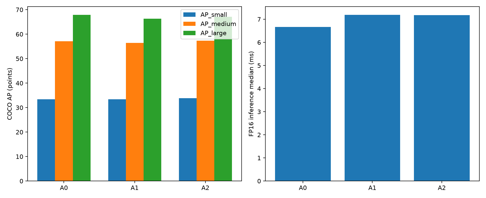

# YOLO11m P2 COCO2017 實驗報告

A1/A2 使用 commit `f34a980df593cb9369aacf5c64d94e605082cb98`、batch 9、seed 0 與 RTX 5090；A1 直接 fine-tune 100 epochs，A2 為 20 epochs 新 P2-only + 73/80 epochs 低 LR 全模型微調；A0 為官方 `yolo11m.pt`。
官方公布 YOLO11m：COCO mAP@.50:.95 51.5、20.1M params、68.0 GFLOPs；官方速度為 CPU ONNX 183.2 ms / T4 TensorRT10 4.7 ms，不與本機 PyTorch FP16 直接混比。

指標定義：**COCO API mAP@.50:.95** 是使用官方 COCO annotation JSON 與 faster-coco-eval 計算；**Ultralytics mAP@.50:.95** 是同一組 val2017 預測由 Ultralytics 內建 validator 計算。兩者都是 IoU 0.50–0.95 的 mAP，但 evaluator 實作不同，因此數值不完全相同。官方公布值只適用 A0，A1/A2 沒有官方發布結果。

## 完成狀態與版本定義

排程狀態檔為 `completed`；A1/A2 正式訓練 CSV、四個有效 `best.pt`、三組 COCO 評估結果與三組 benchmark 結果均已封存。可由 `last.pt` 重建的續訓權重已在成果整理後移除。另以 Ultralytics 8.4.90 在 CPU 上實際載入 A0/A1/A2 checkpoint，三者皆可正常解析為 detection model。

| 版本 | 本研究中的角色 | Detect 輸出尺度 | 本機正式訓練狀態 | 最終評估權重 |
| --- | --- | --- | --- | --- |
| A0 | 官方 YOLO11m 對照組 | P3/P4/P5，stride 8/16/32 | 未重訓 | 官方 `yolo11m.pt` |
| A1 | YOLO11m-P2 Direct | P2/P3/P4/P5，stride 4/8/16/32 | 100/100 epochs | 正式訓練 `best.pt` |
| A2 | YOLO11m-P2 Direct Staged | P2/P3/P4/P5，stride 4/8/16/32 | 20/20 + 73/80 epochs | Stage 2 epoch 39 `best.pt` |

A1 與 A2 的推論架構完全相同，差別只在訓練方式：A1 直接全模型 fine-tune；A2 先訓練新 P2 分支 20 epochs，再以較低初始學習率解凍全模型微調。**本次正式 A2 不是額外 feature-fusion 模型**；先前 B 系列屬於 invalidated 實驗，不納入正式比較，相關大型中間產物已在成果整理時移除。

## 資料集與共同訓練設定

| 分割 | 影像數 | 物件標註數 | 類別數 | 每張平均標註數 |
| --- | ---: | ---: | ---: | ---: |
| COCO train2017 | 118,287 | 860,001 | 80 | 7.27 |
| COCO val2017 | 5,000 | 36,781 | 80 | 7.36 |
| 合計 | 123,287 | 896,782 | 80 | 7.27 |

共用 COCO2017 影像資料約 20 GiB；本專案保留 YOLO labels、影像連結與約 468 MiB 的官方 COCO annotation JSON。正式訓練共同設定為 imgsz 640、batch 9、workers 8、seed 0、deterministic、AMP、`fraction=1.0`、單張 NVIDIA GeForce RTX 5090；軟體版本為 Ultralytics 8.4.90、PyTorch 2.11.0+cu128、CUDA runtime 12.8。

## 實際訓練量與資源投入

118,287 張訓練影像可被 batch 9 整除，因此每個完整 epoch 恰為 13,143 mini-batches。下表的「累積訓練樣本」是 dataloader image presentations，代表影像進入訓練批次的累積次數，不代表相異影像數；Mosaic 等資料增強仍可能在單一輸出樣本中組合多張來源影像。

| 訓練項目 | 完成/規劃 epochs | 累積訓練樣本 | Mini-batches | 訓練中驗證影像 | 單卡程序累積時間 |
| --- | ---: | ---: | ---: | ---: | ---: |
| A0 本機重訓 | 0 | 0 | 0 | 0 | 0 |
| A1 全模型 fine-tune | 100/100 | 11,828,700 | 1,314,300 | 500,000 | 30 小時 27 分 00 秒 |
| A2 Stage 1：P2-only | 20/20 | 2,365,740 | 262,860 | 100,000 | 3 小時 21 分 46 秒 |
| A2 Stage 2：全模型低 LR | 73/80 | 8,634,951 | 959,439 | 365,000 | 22 小時 21 分 25 秒 |
| **A2 合計** | **93/100** | **11,000,691** | **1,222,299** | **465,000** | **25 小時 43 分 11 秒** |
| **A1 + A2 正式訓練合計** | **193/200** | **22,829,391** | **2,536,599** | **965,000** | **56 小時 10 分 11 秒** |

時間取自各正式 `results.csv` 的 `time` 欄。A1 曾續訓兩次，`time` 在 epoch 66 與 71 重新起算，因此採三段 71,605.7 + 5,493.2 + 32,521.2 秒加總；A2 為 Stage 1 的 12,105.9 秒加 Stage 2 的 80,485.0 秒。這是包含每 epoch 驗證、資料載入與 checkpoint 工作的單卡程序經過時間，可視為約 56.17 RTX 5090 GPU-hours 的占用量，但不是純 CUDA kernel 時間或耗電量。

A2 Stage 2 完成 73/80 epochs（91.25%），整體完成 93/100 epochs。相較原規劃少跑 7 epochs，減少 828,009 個訓練樣本槽位與 92,001 個 mini-batches；依 Stage 2 平均每 epoch 18 分 23 秒估算，約節省 2 小時 09 分。A2 比 A1 少 828,009 個訓練樣本槽位，程序時間少約 4 小時 44 分，但取得較高的最終 COCO mAP。

上述訓練量只計入最後採用的 A1/A2 正式訓練，不含 1% gate、health check、已取消訓練與 `invalidated` 舊 B 系列，因此可直接對應本報告的正式模型。由於 `nbs=64` 且 warmup 期間梯度累積會動態改變，報告採可由資料量精確重建的 mini-batch 數，不宣稱無原始 optimizer trace 支持的 `optimizer.step()` 精確次數。

## 評估與速度測試量

最終準確度評估對 A0/A1/A2 各跑完整 COCO val2017 5,000 張影像與 36,781 個物件標註，合計 15,000 次模型影像評估。速度測試則對每個模型固定抽取 500 張影像，先 warm up 50 次，再重複 3 輪；因此每種精度、每個模型各有 1,500 個計時樣本，FP16 與 FP32 合計為 9,000 個計時樣本。所有本機 latency 均在同一張 RTX 5090、imgsz 640 下取得。

| 版本 | COCO API mAP@.50:.95 | Ultralytics mAP@.50:.95 | 官方公布 mAP@.50:.95 | COCO AP50 | AP75 | APs | APm | APl | Recall |
| --- | ---: | ---: | ---: | ---: | ---: | ---: | ---: | ---: | ---: |
| A0 | 51.53 | 51.00 | 51.50 | 68.47 | 55.74 | 33.43 | 57.12 | 67.87 | 69.21 |
| A1 | 51.18 | 50.65 | N/A | 68.33 | 55.86 | 33.41 | 56.39 | 66.27 | 70.09 |
| A2 | 51.78 | 51.24 | N/A | 69.02 | 56.36 | 33.83 | 57.34 | 67.06 | 70.46 |

| 版本 | Params | GFLOPs | FP16 ms | 訓練 VRAM GiB |
| --- | ---: | ---: | ---: | ---: |
| A0 | 20.11M | 68.5 | 6.66 | N/A |
| A1 | 20.49M | 87.9 | 7.19 | 15.5 |
| A2 | 20.49M | 87.9 | 7.18 | 15.5 |

| 版本 | 模型 MiB | 推論 VRAM GiB | FP16 med/p95 ms | FP16 E2E ms | FP32 med/p95 ms | FP32 E2E ms |
| --- | ---: | ---: | ---: | ---: | ---: | ---: |
| A0 | 38.80 | 0.126 | 6.664/6.838 | 44.394 | 7.372/7.579 | 43.878 |
| A1 | 39.59 | 0.168 | 7.188/7.457 | 44.419 | 8.178/8.440 | 45.631 |
| A2 | 39.58 | 0.168 | 7.180/7.466 | 44.527 | 8.180/8.356 | 46.800 |

小物準確度勝者為 **A2 (YOLO11m-P2 Direct Staged)**。
效率 Pareto frontier：**A0, A2**。
A1/A2 都進行了額外 fine-tune，因此對 A0 的差異同時包含架構與訓練效應，不是純架構消融。
A2 Stage 2 原訂 80 epochs，但在完成 epoch 73 後依使用者指示提前停止；後期指標持續下降，正式評估使用 epoch 39 的 best.pt（Ultralytics 訓練 mAP@.50:.95 51.214）。

## A2 分階段策略判定

A2 達成全方位提升：COCO mAP 高於 A1，且 AP_small / AP_medium / AP_large 均未退步。
A2 相對 A1 的 AP 點數變化：AP50-95 +0.60、Ultralytics_mAP50-95 +0.59、AP50 +0.69、AP75 +0.50、AP_small +0.42、AP_medium +0.95、AP_large +0.80。A1/A2 推論架構相同，因此 Params 與 GFLOPs 必須完全一致。

## 最終建議

A2 相對本機 A0：COCO API mAP@.50:.95 +0.25、Ultralytics mAP@.50:.95 +0.24、COCO AP50 +0.55、AP75 +0.61、AP_small +0.40、AP_medium +0.22、AP_large -0.80、Recall +1.26 AP；Params +1.87%、GFLOPs +28.27%、FP16 median +7.74%。
A2 在總 mAP、小物、中物與 Recall 上勝過 A0，也全面勝過相同推論成本的 A1；因此若主要目標是整體與小物準確度，推薦 A2。
A2 的大物件 AP 相對 A0 下降 0.80，且 GFLOPs 增加約 28.27%；若大物件或效率優先，A0 仍是較合理選擇。A1 被 A2 以相同成本全面壓過，不建議採用。

## 尺度退化檢查

- A1 AP_small 相對 A0 退化 -0.02 AP。
- A1 AP_medium 相對 A0 退化 -0.73 AP。
- A1 AP_large 相對 A0 退化 -1.60 AP。
- A2 AP_large 相對 A0 退化 -0.80 AP。

完整絕對值、相對 A0 增量與百分比見 `comparison.csv`；機器可讀摘要見 `summary.json`。
