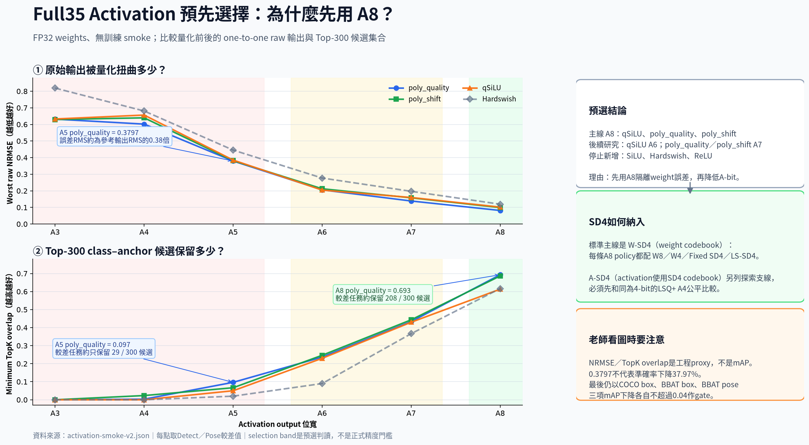

# Full35 Activation預先選擇報告

日期：2026-08-29

## 實驗身分與證據邊界

| 項目 | 固定契約 |
|---|---|
| 模型 | accepted Full35 Detect＋Pose，23個shared layers、one-to-one end-to-end heads |
| Checkpoint | `best_joint.pt`，SHA-256 `d67fb45c576035e1b9c607914c62fa2c46bad84a5f53dea2c95ea7d4155ec74c` |
| Activation矩陣 | SiLU、qSiLU、poly_quality、poly_shift、Hardswish × LSQ+ A3至A8，共30格 |
| Weight | 全程FP32；這份報告沒有執行W8、W4、SD4或ternary weight量化 |
| Calibration | Detect與Pose各2張canonical train exemplar；BBAT5兩張來自不同`.rf.` source group |
| Probe | Detect與Pose各1張canonical val exemplar；不是完整validation |
| 資料 | COCO2017 Detect＋Canonical BBAT5 v1 Pose；未改assignment、labels或split |
| 比較基準 | 同一activation function、quantization disabled、FP32 weight的matched輸出 |
| 圖與指標來源 | 30／30 passed的`activation-smoke-v2.json`，不是人工抄表 |
| 執行環境 | NVIDIA GeForce RTX 5090、PyTorch 2.11.0、CUDA 12.8 |
| Training | 無optimizer、無backward、無epoch；`formal_training=false` |

Full35的190個可替換SiLU函數位置中，只有124個部署推論會經過的位置加入activation-output quantizer；66個one-to-many／pose_flow training-only位置不計入部署量化。Binary Q/K、MASF、attention PWL與decode契約維持不變。

## 一頁結論

第一輪weight量化先使用A8，不直接使用A3至A5。預選三條完整policy：

1. qSiLU＋A8：保留上游short-recovery的mAP餘裕。
2. poly_quality＋A8：本次activation-output數值proxy最佳。
3. poly_shift＋A8：保留硬體導向的shift／APoT角色。

qSiLU＋A6、poly_quality＋A7、poly_shift＋A7只列為後續研究。依使用者要求，不再新增SiLU實驗；Hardswish與ReLU也不晉級。

可直接外部分享的版本：

- [PNG](../../deliverables/activation-preselection-teacher-v1.png)：一般簡報與通訊軟體。
- [SVG](../../deliverables/activation-preselection-teacher-v1.svg)：可縮放向量圖，適合再排版。
- [PDF](../../deliverables/activation-preselection-teacher-v1.pdf)：單頁老師版附件。

## 兩個指標到底是什麼

### Worst raw NRMSE

NRMSE計算量化後輸出和matched FP輸出的相對均方根誤差：

    sqrt(sum((quantized - reference)^2) / sum(reference^2))

本報告分別計算Detect與Pose one-to-one raw輸出，再取較差任務。零代表完全相同，數值越低越好。

0.3797的意思是「量化誤差的RMS約為參考輸出RMS的0.38倍」，不是mAP下降37.97%，也不是準確率剩62.03%。

raw輸出在TopK、decode之前，因此比只看decoded tensor更容易定位量化本身造成的改變；但它仍然只是proxy，不能取代完整validation。

### Minimum TopK selected-pair overlap

Full35會從class–anchor score中選Top-300候選。overlap計算：

    size(quantized TopK intersect reference TopK) / 300

同樣分別計算Detect與Pose，再取較差任務。1代表300個候選都相同，0代表完全沒有交集，越高越好。

- 0.0967約等於29／300：較差任務只保留約29個相同候選。
- 0.6933約等於208／300：較差任務約保留208個相同候選。

因此poly_quality A5的0.3797／0.097表示raw輸出扭曲仍大，而且Top-300候選已大幅改變；這是A5不晉級的原因，不是因為我們把0.3797誤當成mAP。

## A3至A8結果

| A-bit | 最低worst raw NRMSE | 最高minimum TopK overlap | 預選判定 |
|---|---|---|---|
| A3 | poly_shift 0.629569 | 0.0000 | 主線淘汰 |
| A4 | poly_quality 0.601968 | poly_shift 0.0233 | 主線淘汰 |
| A5 | poly_quality 0.379727 | poly_quality 0.0967 | 不晉級 |
| A6 | qSiLU 0.204463 | poly_shift 0.2467 | 研究候選 |
| A7 | poly_quality 0.138725 | poly_shift 0.4433 | 探索候選 |
| A8 | poly_quality 0.081644 | poly_quality 0.6933 | weight敏感度主線 |

最低NRMSE與最高overlap有時來自不同activation，因此不能用單一數字選winner。A8的poly_quality同時在兩個proxy最好，但qSiLU仍有上游mAP recovery優勢，poly_shift仍有硬體優勢，所以保留三條角色而非只留一條。

## 為什麼不直接選A6或A7

A6／A7比A3至A5好，但仍有兩個問題：

1. TopK overlap在較差任務僅約0.23至0.44，尚未證明完整mAP安全。
2. 下一階段還要加入INT8、INT4、SD4或ternary weights。如果activation和weight同時大幅降位元，無法辨別損失來自哪一邊。

因此先用A8固定activation誤差，找出weight-sensitive regions；選出mixed weight policy後，再分別把activation降到A7或A6並重跑完整policy。

## SD4怎麼納入

### W-SD4：主要納入方式

標準SD4是weight codebook。三條A8預選policy都會和下列weight格式配對：

| Activation parent | W8 | W4 | Fixed SD4 | LS-SD4 |
|---|---:|---:|---:|---:|
| qSiLU＋A8 | 測 | 測 | 測 | 測 |
| poly_quality＋A8 | 測 | 測 | 測 | 測 |
| poly_shift＋A8 | 測 | 測 | 測 | 測 |

Fixed SD4至少比較max scale與MSE scale；LS-SD4先做layer-wise learnable scale，穩定後才測grouped與per-output-channel upper bound。所有SD4結果都要和同activation、同region、同budget的INT4比較。

SD4是否適合不能只看「權重小不小」，要看近對數幅值占用、codebook reconstruction、clipping、scale metadata與layer output sensitivity。

### A-SD4：activation直接使用SD4的探索支線

若希望activation output也使用SD4 codebook，必須另命名為A-SD4，不能和W-SD4混在一起。這是可納入的研究方向，但目前尚未實作或測試。

原因是qSiLU、poly_quality與poly_shift輸出通常有負值小尾巴、偏斜正值與動態range；對稱signed SD4不一定比uniform asymmetric LSQ+適合。

第一個A-SD4公平實驗應該是：

| Cell | Activation function | Activation format | Weight |
|---|---|---|---|
| Control | 三條候選各自測 | LSQ+ A4 | FP32 |
| A-SD4 fixed | 同一function與parent | signed SD4＋per-boundary MSE scale | FP32 |
| A-SD4 learnable | 同一function與parent | SD4＋learnable range scale | FP32 |

三格必須使用相同parent checkpoint、boundary清單、calibration images與validation budget。先報signed log-magnitude occupancy、正負不平衡、zero fraction、clipping、codebook NRMSE、layer output NRMSE與TopK overlap；只有Pareto不劣於LSQ+ A4，才進完整validation或QAT。

目前uniform LSQ+ A4的TopK overlap最高也只有0.0233，所以A-SD4若只是另一個4-bit表示法，不能預設會成功；它必須用實驗證明能改善codebook匹配。

## 對老師的建議說法

可以用以下方式簡短說明：

「我們不是直接以activation函數曲線誤差選winner，而是把每個activation和實際A-bit一起測。A3至A5在Top-300候選集合上變化過大，因此先用A8隔離後續weight量化誤差；同時保留qSiLU的mAP恢復優勢、poly_quality的數值優勢與poly_shift的硬體優勢。SD4先作weight codebook，activation用SD4則另設同為4-bit的公平對照。」

## 限制

- 數據來自每task兩張calibration及一張probe的no-training smoke。
- NRMSE與TopK overlap不是mAP。
- 本報告是預先選擇，不是正式winner宣告。
- A-SD4目前只有實驗定義，沒有結果。
- 最終仍以COCO box、BBAT box、BBAT pose三項mAP下降各自不超過0.04判斷。

## 已量測、推論與尚未量測的分界

| 類型 | 本報告可以說什麼 | 本報告不能說什麼 |
|---|---|---|
| 已量測 | 30格皆可執行；每格的raw NRMSE、TopK overlap與graph contract | 不能把`passed`解讀為精度通過 |
| 直觀換算 | 0.0967約為29／300、0.6933約為208／300個相同候選 | 不能換算成mAP或準確率百分比 |
| 預選決策 | A8先隔離weight誤差；三條policy保留不同研究角色 | 不是正式activation winner |
| 未來設計 | W-SD4與A-SD4的公平比較矩陣已定義 | 尚無SD4實測結果 |
| 未量測 | 無 | 無完整mAP、QAT、bit-true export、板上latency／power／resource |

## 驗證紀錄

- 產出時完整CPU suite為`34 passed`，Ruff與格式檢查通過。
- source JSON為30／30 passed、0 failed；A5與A8數值由JSON重新計算，沒有手動改寫。
- PNG為2471×1361 RGBA、PDF為1頁、SVG可解析。
- 使用固定PDF metadata與SVG ID salt；重建出的PNG、SVG與PDF可和正式成品逐位元一致。
- 詳細驗證、困難與解法見[工作紀錄](../worklogs/2026-08-29-activation-preselection-figure.md)。

## 可追溯產物

- [完整source JSON](../../artifacts/reports/activation-smoke-v2.json)／[CSV摘要](../../artifacts/reports/activation-smoke-v2-summary.csv)。
- [Smoke machine-readable契約](../../configs/experiments/activation-smoke-v2.yaml)／[預選machine-readable契約](../../configs/experiments/activation-preselection-v1.yaml)。
- [可重建繪圖腳本](../../scripts/render_activation_preselection.py)。

- 來源JSON SHA-256：3c9301adaa1937f50bdd0c059f7d8000ea4699ce229e98c8ddb387651340c1f1
- PNG SHA-256：3bfe999ce0fd9ed2fde79500cc03a5484d3459647ced29a28ae58023d5c50684
- SVG SHA-256：82ea786c5be8558659a790f3a85ee834a48bb12f8b77e191ddbe15459b7ec103
- PDF SHA-256：8b1ca9e44cf1679d924cfe08197782ce575d2c9d1c2ee41965b22e791002a551
- 繪圖腳本SHA-256：ee1f7d3fa80a33451faeebdfa61722ed8eb74fe658e6dfb8d2f7b7af4cd2bbd4
- machine-readable契約SHA-256：db6117aea9b3d5bdb02ca809e3a78c98d8df35919f9b12e2967a8ec5188e9c98
